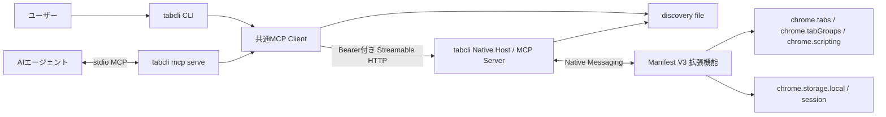
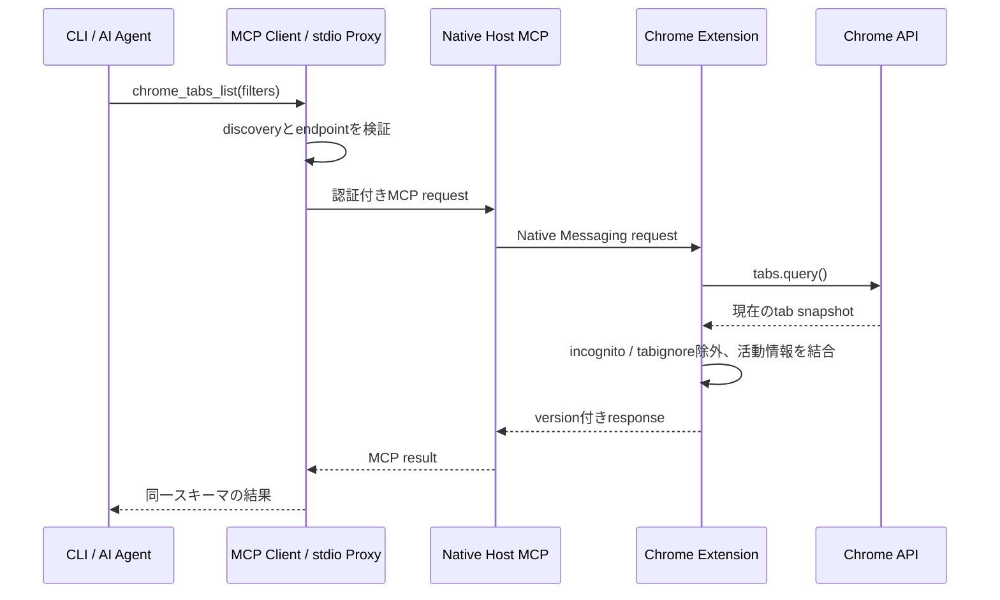
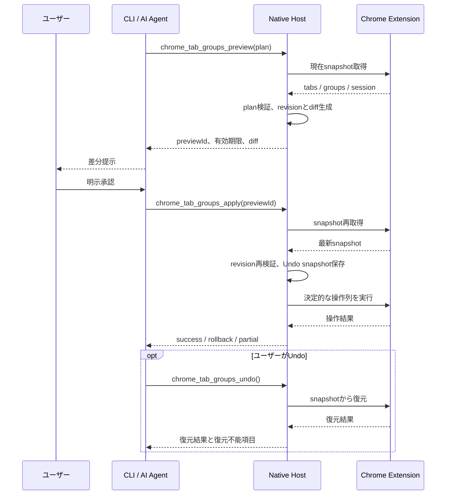

# 機能実装計画: tabcli MVP（macOS）

## 機能概要

Google Chromeで現在開いているタブを、ローカルのCLIまたはMCP対応AIエージェントから参照・分類し、ユーザーが差分を確認してからChromeネイティブのタブグループへ安全に反映できるようにする。

Chrome拡張機能がChrome APIとの境界を担当し、Chromeがオンデマンド起動する単一のGo実行ファイル `tabcli` がNative Messaging Host、認証付きStreamable HTTP MCP、stdio MCPプロキシ、CLIを提供する。製品自身はLLMを呼び出さず、タブ情報やページ本文を外部へ自動送信しない。

本計画の対象は `docs/requirements.md` Draft 0.6に定義されたMVPのうち、初回提供OSをmacOSに限定した範囲である。Windows固有の実装・検証・配布は本MVP完了後へ延期する。

## 目的

- 普段利用している単一のChromeプロファイルのタブを、Chromeを別プロファイルで起動せず整理できるようにする。
- CLIとAIエージェントで同じ検証・操作ロジックを利用し、インターフェース間の挙動差をなくす。
- 一括変更をプレビューと明示承認で保護し、失敗時のロールバックと直前1回のUndoを提供する。
- 固定ポートや常駐デーモンを使わず、Chromeのライフサイクルに追従して安全に起動・終了する。
- タブ情報と明示取得したページ本文をローカルで最小限に扱い、プライバシー境界を明確にする。

## 要件

- Chrome拡張機能はManifest V3のTypeScriptで実装し、配布物にはビルド済みJavaScriptだけを含める。
- Native Host、HTTP MCP、stdio MCPプロキシ、CLIはGoと公式MCP Go SDKで実装し、`CGO_ENABLED=0` で `darwin/arm64` と `darwin/amd64` 向けにビルドする。
- Chrome拡張機能とNative HostはNative Messagingだけで通信し、Native Hostは `127.0.0.1` のランダムポートに認証付きStreamable HTTP MCPを公開する。
- CLIとstdio MCPプロキシは、所有者限定かつ原子的に更新されるdiscovery fileから接続先を解決する。
- MCPツールは要求仕様の9個に限定し、スキーマ、ツール説明、エラー定義を単一の定義元から共有する。
- タブ一覧、グループ一覧、放置期間、活動メタデータを読み取り専用で取得できる。
- ページ本文は、明示指定された1タブのmain frameから上限付きで取得し、明示指定された2タブは本文を返さないSHA-256比較または変更行だけの差分取得を行える。
- 分類変更は必ずプレビューを経由し、ユーザー承認済みの有効な `previewId` だけを適用する。
- プレビュー後のタブ・グループ状態変化を検出して適用を拒否し、一部失敗時は可能な範囲でロールバックする。
- 直前1回の一括適用について、タブ位置・所属グループ・グループ名・色・折りたたみ状態をUndoできる。
- シークレットタブと `tabignore` 対象を既定で除外し、URL、タイトル、本文、認証情報をログやテレメトリへ出力しない。
- macOSの現在ユーザー領域へインストールでき、Apple silicon・Intel向けにDeveloper ID未署名・アドホック署名済みの成果物を生成する。

## MVP対象外

- 複数Chromeプロファイル、複数端末、クラウド同期、Linuxの正式サポート
- Windows向け実装・成果物、HKCU登録、Windows ACL、Authenticode署名
- Chrome Web Store、unlisted、組織ポリシーによる拡張機能配布
- 自動タブクローズ、閲覧履歴や閉じたタブの長期保存、ブックマーク・Cookie・フォーム値の操作
- ページ本文の自動・任意多数タブの一括取得、永続保存、任意JavaScript実行
- 製品内からのLLM API呼び出し
- 2件以上のUndo履歴、固定ポート、Unix Domain Socket、Windows Named Pipe、常駐ランチャー

## シンプル実装の方針

- 新規開発のため後方互換層や移行コードは作らず、プロトコル変更時は旧定義を残さない。
- 将来の複数プロファイル、Linux、Undo履歴拡張を先取りせず、MVPの単一プロファイル・直前1件に限定する。
- 要求仕様にないリトライ、キャッシュ、永続状態、汎用プラグイン機構を追加しない。
- ただし、要求仕様に明記された認証、権限検証、stale検出、ロールバック、構造化エラーは製品要件であり、省略しない。
- MCPツールカタログをGo側の単一定義元とし、Native Host、stdioプロキシ、CLIヘルプで再利用する。
- Chrome API依存を薄いadapterに閉じ込め、分類計画、差分計算、活動メタデータ更新などは純粋関数としてテストする。
- Chrome拡張のソースはTypeScriptだけとし、`extension/src` に手書きJavaScriptを置かない。manifestが参照するJavaScriptはすべてclean buildで `extension/dist` へ生成する。
- Native Host内の状態は、起動中のpreviewと直前1件のUndoだけに限定する。Native Host再起動後は `UNDO_UNAVAILABLE` とする。
- まず正しく動く最小実装を作り、500タブ・200タブ適用の性能目標は計測結果に基づいて最終フェーズで最適化する。
- デバッグログは構造化してstderrだけへ出し、URL、タイトル、本文、Bearer Tokenをフィールドへ含めない。必要な一時ログはGoのdebug build tagまたは拡張機能の開発ビルドへ分離する。

## 採用するソース構成

実装開始時点では以下を上限とし、責務が増えるまで追加の抽象化や階層を作らない。

```text
cmd/tabcli/                 # 単一バイナリのエントリーポイント
internal/app/               # CLI / Native Host / stdio proxy のモード選択
internal/tools/             # MCPツール、JSON Schema、共通エラーの単一定義元
internal/nativemsg/         # Native Messaging framingとChrome bridge
internal/discovery/         # discovery fileの生成・検証・削除
internal/mcpserver/         # 認証付きStreamable HTTP MCP
internal/mcpclient/         # CLIとstdio proxyで共有するMCPクライアント
internal/plan/              # revision、preview、apply、rollback、Undo
internal/install/           # macOSのユーザー別登録
extension/src/              # Service Worker、Chrome API adapter、設定UI
extension/tests/            # Chrome非依存ロジックの単体テスト
skills/tabcli/# AIエージェント向けSkill
docs/                       # 要求仕様と実装計画
```

## システム構成



## 主要な設計判断

### プロトコルとスキーマ

- `protocolVersion` は整数 `3` とし、Native Messaging、discovery file、MCP応答に含める。完全一致だけを許可し、不一致は `PROTOCOL_VERSION_MISMATCH` とする。製品バージョンは別のSemVerとして管理する。
- MCPのツール名、入力・出力型、read-only hint、説明、エラー、CLI対応情報を `internal/tools` の型付きカタログで一度だけ定義する。
- Chrome拡張機能とのNative Messagingは、request ID、operation、protocolVersion、payload、errorを持つ小さなrequest/response envelopeに限定する。
- CLIはChrome操作を直接呼ばず、すべて共通MCPクライアント経由とする。

### discoveryと認証

- Native Hostは先に `127.0.0.1:0` でlistenし、256 bit以上のBearer Tokenとinstance IDを生成してからdiscovery fileを公開する。
- discovery fileは同一ディレクトリの一時ファイルを同期後にrenameし、0700のディレクトリと0600のファイルで現在ユーザーだけに公開する。
- クライアントはsymlink、所有者、PID、instance ID、protocolVersion、loopback endpointを検証する。通常操作ではdiscovery原因を `BROWSER_DISCONNECTED` に正規化し、`status` と `doctor` だけが詳細コードを表示する。
- HTTP middlewareでBearer Token、Host、Originを明示検証し、CORSは提供しない。

### previewと状態revision

- `previewId` は暗号学的乱数で生成し、Native Hostのメモリ内だけに保持する。有効期限は生成時から5分とする。
- revisionはブラウザーセッションIDと、対象タブ・グループの操作に必要なフィールドを正規順序でシリアライズしたSHA-256とする。
- apply直前に同じsnapshotを再取得してrevisionを比較し、不一致なら操作を一件も実行せず `PLAN_STALE` を返す。
- 既存グループは同名衝突を避けるためgroup IDで指定し、新規グループだけtitleとcolorで指定する。概念スキーマにはoptionalな `groupId` を追加する。
- 一つの論理グループに複数ウィンドウのタブが含まれる場合、previewでウィンドウ別の作成候補へ分割して明示する。具体的な既存group IDと異なるウィンドウの組み合わせは `CROSS_WINDOW_GROUP` とする。

### apply、ロールバック、Undo

- apply前snapshotには対象タブのwindow ID、index、pinned、group IDと、対象グループのtitle、color、collapsedを保持する。URL、タイトル、本文は含めない。
- Chrome API操作は「再検証、必要グループ作成、グループ属性更新、所属変更、並び替え」の決定的な順序で実行し、各操作の結果を記録する。
- 失敗時は記録した成功済み操作を逆順に戻し、完全復元なら `APPLY_FAILED_ROLLED_BACK`、復元不能項目があれば `APPLY_PARTIAL` とする。
- 完全成功後だけ直前のUndo snapshotを置き換える。Undo履歴はNative Hostのメモリ内1件だけとする。

### 活動メタデータと本文

- 活動メタデータはブラウザーセッションIDとtab IDの組で管理し、イベントを純粋なreducerへ渡して固定長snapshotを `chrome.storage.local` に保存する。
- イベントリスナーはService Workerのトップレベルで同期登録し、起動時reconciliationで別セッションと存在しないtab IDを破棄する。
- `tabignore` は拡張機能設定UIで管理する文字列配列とし、Chrome match patternを正式書式にする。`example.com` と `*.example.com` の入力だけはそれぞれ `*://example.com/*` と `*://*.example.com/*` へ正規化する。正規表現、否定規則、独自globは提供せず、Native Messagingへ渡す前に拡張機能内で除外する。
- 本文取得は同梱した固定関数だけをISOLATED worldのmain frameで実行する。結果はキャッシュせず、Native MessagingとMCPを通過する間だけメモリに保持する。
- 抽出時に本文を含まないopaqueな `contentRevision` を発行し、tab ID、URL、document IDとの対応だけを `chrome.storage.session` に保持する。navigation、reload、URL変更、tab削除で即座に無効化する。
- 抽出前後のURLとdocument IDを照合し、変化した結果は `CONTENT_STALE` として破棄する。本文を分類に使った場合は計画へ `contentRevision` を添付し、preview時にも有効性を再検証する。

## 主要シーケンス

### 一覧取得



### プレビュー、適用、Undo



## 段階的実装計画 (TDD サイクル)

各フェーズは、その終了時点で利用可能なユーザー価値を持ち、前フェーズの動作を維持したまま機能を積み上げる。

### フェーズ1: Chromeの現在タブをCLIで確認できる

**ユーザー価値**

ユーザーがChromeで現在開いている通常ウィンドウのタブとグループを、ローカルCLIから読み取り専用で確認できる。

**Red: テストを書く**

- [x] `internal/nativemsg/codec_test.go` にNative Messagingの正常frame、不正長、切断のテストを追加する。
- [x] `internal/app/mode_test.go` に通常CLI起動と、許可済み・未許可の拡張機能OriginによるNative Host起動判定を追加する。
- [x] `internal/discovery/file_test.go` に原子的作成、権限、symlink拒否、stale PID、protocol不一致を追加する。
- [x] `internal/mcpserver/security_test.go` にBearerなし、Host不一致、Originあり、loopback以外の設定拒否を追加する。
- [x] `internal/tools/list_test.go` にChrome bridgeのfixtureを使ったタブ・グループ一覧とシークレット除外を追加する。
- [x] `internal/cli/list_test.go` に表形式とJSON出力、Chrome未接続時の終了コードを追加する。
- [x] `extension/tests/snapshot.test.ts` に通常・シークレット・操作不能タブ、`tabignore` の変換テストを追加する。
- [x] Native Host異常終了時の再接続間隔、試行上限、同時接続が一本だけであることをfake timerで検証する。

**Green: 最小実装**

- [x] Go moduleを作成し、公式MCP Go SDKの検証済みバージョンを `go.mod` と `go.sum` に固定する。
- [x] `cmd/tabcli` と `internal/app` に単一バイナリのモード選択を実装する。
- [x] `extension/src` のTypeScriptから `extension/dist` のJavaScriptを生成するclean buildと、Manifest V3拡張機能、トップレベルのイベント登録、単一 `connectNative()` 接続を実装する。
- [x] MVP専用鍵を一度だけローカル生成し、公開鍵をmanifestの `key` に保存する。導出された固定拡張機能IDをNative Messagingの `allowed_origins` とGoバイナリへ組み込み、秘密鍵はrepository・build成果物へ含めない。
- [x] version付きhandshakeとNative Messagingのrequest/response framingを実装する。
- [x] `127.0.0.1:0` の認証付きStreamable HTTP MCPと安全なdiscovery file lifecycleを実装する。
- [x] `chrome_tabs_list` と `chrome_tab_groups_list` を実装する。
- [x] `tabcli install` のユーザー別Native Messaging登録、`tabcli status`、`tabcli tabs list`、`tabcli groups list` を実装する。
- [x] Native Host終了時にHTTP serverを停止し、discovery fileを削除する。
- [x] Native Host異常終了時に、拡張機能から上限付き指数バックオフで再接続する。

**Refactor**

- [x] MCPツールカタログ、共通エラー、Chrome snapshot変換の重複を除去する。
- [x] テスト用Chrome bridgeと本番Native Messaging bridgeを同じ最小interfaceへ揃える。
- [x] 一時デバッグログを削除し、残すログが機密フィールドを持たないことを確認する。

**確認手順**

1. `go test ./...` を実行し、Goの単体・結合テストが成功することを確認する。
2. `npm --prefix extension test` と `npm --prefix extension run build` を実行する。
   - `extension/src` に手書きJavaScriptがなく、空にした `extension/dist` がTypeScriptから再生成されることを確認する。
3. `CGO_ENABLED=0 go build ./cmd/tabcli` で `tabcli` を生成し、`tabcli install` を実行する。
4. 開発ビルドの拡張機能をChromeへ読み込み、通常・pinned・グループ化済みタブを用意する。
5. `tabcli tabs list --json` と `tabcli groups list --json` を実行する。
6. Chromeを終了し、`tabcli status` がブラウザー未接続を返し、Native Hostとdiscovery fileが残らないことを確認する。

**期待結果**

- CLIにChromeの現在状態と一致する一覧が返り、一覧取得によるChrome状態変更がない。
- HTTP MCPはloopbackだけで待ち受け、未認証・不正Host・Origin付きrequestを拒否する。
- Chrome終了後に製品プロセスとdiscovery fileが残留しない。

---

### フェーズ2: AIエージェントから同じ一覧を参照できる

**ユーザー価値**

ユーザーがCodexやClaudeなどのstdio MCPクライアントから、CLIと同一内容のタブ・グループ一覧を取得できる。

**Red: テストを書く**

- [x] `internal/mcpclient/client_test.go` にdiscovery解決、認証、protocol不一致、上流切断を追加する。
- [x] `internal/app/proxy_test.go` にMCP初期化、tools/list、tool callの透過中継を追加する。
- [x] Native Host未起動時も初期化とtools/listが成功し、実行だけが `BROWSER_DISCONNECTED` になるテストを追加する。
- [x] stdio切断後にproxyが終了し、stdoutにMCP message以外を出さないテストを追加する。
- [x] 直接HTTP、stdio proxy、CLI JSONの結果とエラーコードを比較するcontract testを追加する。

**Green: 最小実装**

- [x] CLIとstdio proxyで共有するMCPクライアントを実装する。
- [x] `tabcli mcp serve` をstdio MCP serverとして実装し、共通ツールカタログをそのまま公開する。
- [x] 上流未接続でも静的なinstructionsとtool一覧を返し、tool実行時に構造化接続エラーを返す。
- [x] stdin EOF、親とのpipe切断、上流HTTP切断に対する終了処理を実装する。
- [x] MCP instructionsへ「一覧取得、プレビュー、ユーザー確認、適用」の順序を記載する。

**Refactor**

- [x] HTTP MCPとstdio MCPの型変換を除去し、tool catalogとresult/error型を共有する。
- [x] CLI固有の表示処理をMCPクライアントから分離する。

**確認手順**

1. `go test ./...` を実行する。
2. MCP inspectorまたは小さなテストクライアントから `tabcli mcp serve` を起動する。
3. Chrome起動中に `chrome_tabs_list` と `chrome_tab_groups_list` を呼び、CLI JSONと一致することを比較する。
4. Chrome停止中にMCP初期化とtools/listが成功し、tool callだけが `BROWSER_DISCONNECTED` になることを確認する。
5. MCPクライアントを終了し、proxyプロセスが残留しないことを確認する。

**期待結果**

- AIエージェントとCLIが同一のツール定義、結果、エラーを利用する。
- 接続先やBearer TokenをAIエージェント設定へ記載せずに利用できる。

---

### フェーズ3: 放置タブと活動メタデータを確認できる

**ユーザー価値**

ユーザーが7日以上など指定期間アクティブでないタブを絞り込み、観測できた範囲の作成・選択・移動・グループ変更情報を確認できる。

**Red: テストを書く**

- [x] `extension/tests/activity-reducer.test.ts` に作成、選択、更新、移動、attach/detach、削除、グループイベントを追加する。
- [x] 導入前タブ、導入後作成タブ、Chrome snapshotだけのタブについて完全性区分と `createdAt=null` を検証する。
- [x] Service Worker再起動、ブラウザーセッション変更、tab ID再利用、存在しないレコード削除のreconciliation testを追加する。
- [x] シークレットタブを記録せず、閉じたタブのmetadataを削除するテストを追加する。
- [x] 必須listenerがService Worker module評価時に同期登録され、storageがtrusted context限定であることを検証する。
- [x] `internal/tools/tabs_list_test.go` にinactive filter、4種類のsort、null/unknownの扱いを追加する。
- [x] `internal/cli/duration_test.go` に `30m`、`24h`、`7d` と不正値を追加する。

**Green: 最小実装**

- [x] `chrome.storage.session` にブラウザーセッションIDを保持する。
- [x] タブ・グループイベントを純粋なactivity reducerへ接続し、固定長metadataを `chrome.storage.local` に保存する。
- [x] `chrome.storage.local` のaccess levelをtrusted context限定に設定する。
- [x] 拡張機能起動時に現在タブとmetadataをreconcileする。
- [x] `lastAccessed` から `inactiveDurationSeconds` を算出し、取得不能時は推測せずnull/unknownを返す。
- [x] `chrome_tabs_list` のfilter、sort、`includeActivity` を実装する。
- [x] `tabcli tabs list --inactive-for` と `--sort` をMCP入力へ変換する。

**Refactor**

- [x] Chrome event objectからactivity eventへの変換とreducerを分離する。
- [x] storage書き込みをイベント単位で無制限に増やさず、同一tickの更新を一回にまとめる。ただし永続queueは作らない。

**確認手順**

1. `npm --prefix extension test` と `go test ./...` を実行する。
2. 拡張機能導入前から存在するタブと、導入後に作成したタブを用意する。
3. タブの選択、移動、グループ変更を行い、CLI JSONで時刻・回数・完全性だけが更新されることを確認する。
4. Service Workerを停止・再起動し、現在タブのmetadataが復元されることを確認する。
5. `tabcli tabs list --inactive-for 7d --json` とMCPの `inactiveForSeconds=604800` の結果が一致することを確認する。

**期待結果**

- 不明な作成時刻や放置期間を推測せず、データ完全性と追跡開始時刻を明示する。
- 一覧取得だけではタブの移動、グループ変更、クローズが発生しない。

---

### フェーズ4: 明示したタブの本文を安全に取得・比較できる

**ユーザー価値**

タイトルとURLだけでは分類できない場合に限り、ユーザーが明示した1タブの可視テキストを取得できる。2タブの内容確認では、本文を返さないSHA-256一致判定を優先し、必要な場合だけ変更行を返せる。

**Red: テストを書く**

- [x] `extension/tests/content.test.ts` にmain frameの固定抽出、10,000/50,000文字境界、切り詰め、文字数情報を追加する。
- [x] 権限なし、注入不能ページ、シークレット、`tabignore`、抽出失敗を各エラーへ対応付けるテストを追加する。
- [x] URLまたはdocument IDが抽出前後で変化した場合の `CONTENT_STALE` を追加する。
- [x] 抽出後のnavigation、reload、URL変更、tab削除で `contentRevision` が無効になることを追加する。
- [x] iframe、HTML、Cookie、Web Storage、フォーム値を抽出対象にしないcontract testを追加する。
- [x] `internal/tools/content_test.go` に単一tab ID制約、read-only hint、untrusted flag、非キャッシュを追加する。
- [x] SHA-256既知値、本文非返却、相異なる2 tab ID制約、非キャッシュをテストする。
- [x] 行単位差分が未変更行と比較元全文を返さず、source・diff上限と非最小fallbackを明示することをテストする。
- [x] ログ、storage、preview、Undoに本文が残らないことを検査するテストを追加する。

**Green: 最小実装**

- [x] `scripting` と全HTTP/HTTPSサイトのrequired `host_permissions` をmanifestへ追加し、静的な `content_scripts` と不要な `activeTab` は宣言しない。
- [x] Chrome match patternを検証・正規化して保存する `tabignore` の最小設定UIを実装し、不要になったorigin単位の許可・解除UIを削除する。
- [x] `chrome.scripting.executeScript()` のISOLATED world・main frameで固定抽出関数を実行する。
- [x] `chrome_tab_content_get` と `tabcli tabs content` を実装し、権限不足時は対象originとUI操作手順を返す。
- [x] `chrome_tab_content_compare` と `tabcli tabs compare` を実装し、可視テキスト全体を拡張機能内でSHA-256化して本文を返さない。
- [x] `chrome_tab_content_diff` と `tabcli tabs diff` を実装し、拡張機能内で生成した上限付き変更行だけを返す。
- [x] 本文を含まないopaqueな `contentRevision` を返し、document identityとの対応だけをsession storageへ保持してnavigation時に無効化する。
- [x] 初回利用時に、本文がMCPクライアントと利用中のモデル提供者へ渡り得ることをUI・CLI・Skill用result metadataで説明する。
- [x] 本文を命令ではなくuntrusted dataとして示し、サーバー、proxy、CLIでキャッシュ・自動保存しない。

**Refactor**

- [x] 権限判定、アクセス不能判定、抽出結果整形を独立した純粋関数へ整理する。
- [x] 本文を受け取る型にログ用String表現を実装せず、誤出力しにくい境界を作る。

**確認手順**

1. `npm --prefix extension test` と `go test ./...` を実行する。
2. 通常ページ、Chromeのサイトアクセス設定で制限したorigin、`chrome://`、長文ページ、iframe・フォームを持つページを用意する。
3. CLIとMCPから各ケースを1タブずつ取得し、期待する本文・切り詰め・構造化エラーを確認する。
4. 取得後に `chrome.storage.local`、Native Hostの作成ファイル、stdout/stderrを検査し、本文が残っていないことを確認する。
5. 抽出中にnavigationし、`CONTENT_STALE` となって本文が返らないことを確認する。
6. 同一本文と異なる本文を持つ2タブで `tabs compare` を実行し、本文なしで `match` が正しく切り替わることを確認する。
7. `tabs diff` で変更行だけが返り、未変更行、比較元全文、上限超過部分が返らないことを確認する。

**期待結果**

- 明示された権限内のmain frame可視テキストだけが上限付きで返る。比較では本文を返さず、差分では変更行だけが返る。
- ページ内の命令文が操作として実行されず、本文が製品側へ永続保存されない。

---

### フェーズ5: 分類計画を変更前にプレビューできる

**ユーザー価値**

ユーザーがタブの分類案について、作成・更新・移動・維持・解除の差分をChromeへ反映する前に確認できる。

**Red: テストを書く**

- [x] `internal/plan/schema_test.go` に全policy、既存group ID、新規group、解除、重複tab ID、不明ID、不正色を追加する。
- [x] 本文を分類材料に使った計画について、有効・無効な `contentRevision` を検証するテストを追加する。
- [x] `internal/plan/preview_test.go` に差分なし、作成、更新、移動、解除、pinned維持を追加する。
- [x] `existing_groups_only` が新規groupを拒否し、`preserve_existing` が明示されない既存所属を維持することを追加する。
- [x] 複数windowの論理group分割と、具体的group IDへのcross-window指定拒否を追加する。
- [x] previewがChrome操作を一件も発行しないことをfake bridgeで検証する。
- [x] preview IDの期限、revisionの決定性、関連状態変更による不一致を追加する。

**Green: 最小実装**

- [x] 分類計画の正式JSON Schemaとpolicy semanticsを `internal/tools` に確定する。
- [x] 任意の `contentRevisions` を計画へ添付できるようにし、preview前に拡張機能側のdocument identityと照合する。
- [x] 現在snapshotを正規化し、対象状態revisionを生成する。
- [x] 計画をwindow単位の具体的操作へ正規化し、差分だけを生成する。
- [x] 5分有効のpreview ID、revision、正規化済みplan、差分をNative Hostメモリへ保存する。
- [x] `chrome_tab_groups_preview` と `tabcli groups preview --plan` を実装する。

**Refactor**

- [x] schema validation、policy展開、diff計算、preview保存を分離し、Chrome非依存の純粋処理を維持する。
- [x] 同じ操作やno-opを正規化段階で統合し、apply側で再解釈しない構造にする。

**確認手順**

1. `go test ./...` を実行する。
2. 100タブ以上を含むfixtureで全policyのpreviewを実行する。
3. preview前後のChrome snapshotが完全一致することを確認する。
4. `existing_groups_only` で新規groupを指定し、`PLAN_INVALID` になることを確認する。
5. 本文を使った計画でnavigation後の `contentRevision` が `CONTENT_STALE` として拒否されることを確認する。

**期待結果**

- previewはChromeを変更せず、ユーザーが判断できる具体的差分と期限を返す。
- 曖昧な既存groupやcross-window操作を暗黙に解決しない。

---

### フェーズ6: 承認した分類を適用し、直前の変更をUndoできる

**ユーザー価値**

ユーザーが確認したpreviewだけを一括適用でき、結果が不適切な場合は直前の変更を元へ戻せる。

**Red: テストを書く**

- [x] `internal/plan/apply_test.go` に有効preview、期限切れ、未知ID、state変更、二重適用を追加する。
- [x] fake Chrome bridgeを各操作位置で失敗させ、完全rollbackとpartial rollbackを網羅する。
- [x] `internal/plan/undo_test.go` に完全復元、閉じたtab、削除済みgroup、group名・色・collapsed復元を追加する。
- [x] pinned tabが明示されない限り位置とpinned状態を維持するテストを追加する。
- [x] 成功時だけUndo snapshotが置換され、失敗・previewだけでは置換されないことを追加する。
- [x] apply/undo resultが変更内容、rollback状態、復元不能項目を機械判定可能に返すcontract testを追加する。

**Green: 最小実装**

- [x] apply直前のrevision再検証とpreviewの一回消費を実装する。
- [x] Chrome API用の決定的な操作列と成功済みoperation記録を実装する。
- [x] 一部失敗時の逆順rollbackと、`APPLY_FAILED_ROLLED_BACK` / `APPLY_PARTIAL` を実装する。
- [x] 完全成功時に直前1件のUndo snapshotを保存する。
- [x] `chrome_tab_groups_apply`、`chrome_tab_groups_undo`、対応するCLIコマンドを実装する。
- [x] 閉じたtabなどを除外して可能な項目だけ復元し、復元不能一覧を返す。

**Refactor**

- [x] previewで生成したoperationをapplyがそのまま利用し、差分計算の重複をなくす。
- [x] applyとUndoで共有できるChrome操作primitiveだけを抽出し、汎用transaction frameworkは作らない。

**確認手順**

1. `go test ./...` と拡張機能テストを実行する。
2. 100件以上のタブでpreviewを作成し、承認相当の明示操作後にapplyする。
3. タブ所属、位置、group名・色・collapsedがpreview差分どおりになったことを確認する。
4. preview後にタブを手動移動してapplyし、一件も変更せず `PLAN_STALE` になることを確認する。
5. apply直後にUndoし、適用前snapshotと比較する。
6. テスト用bridgeで途中失敗を発生させ、rollback結果と部分適用項目が正確に返ることを確認する。

**期待結果**

- previewなし、期限切れ、staleな計画は一件も変更せず拒否される。
- 成功、rollback済み失敗、部分適用が明確に区別され、直前の成功操作をUndoできる。

---

### フェーズ7: CLI、Skill、診断を利用者向けに完成させる

**ユーザー価値**

ユーザーが一貫したCLIとSkillの手順で製品を導入・診断・利用・削除でき、AIエージェントが承認境界とプライバシー境界を守って操作できる。

**Red: テストを書く**

- [x] 全CLIコマンドの引数、JSON出力、終了コード、help生成のgolden testを追加する。
- [x] `doctor` が実行ファイル、macOS Native Messaging manifest、discovery、Chrome、MCPを変更せず診断するテストを追加する。
- [x] `uninstall` が製品管理下の登録・設定だけを削除するテストを追加する。
- [x] Skillの代表発話について、期待するtool sequence、policy、7日既定値、承認前apply禁止をfixtureで検証する。
- [x] 本文中の命令、権限不足、createdAt不明、Chrome未起動時のSkill応答を検証する。
- [x] MCP tool catalogとCLI helpのschema driftを検出するテストを追加する。

**Green: 最小実装**

- [x] `version`、`uninstall`、`doctor` を完成させ、全コマンドの人間向け表示とJSON表示を揃える。
- [x] エラーコードをCLI終了コードへ一意に変換する。
- [x] `tabcli` Skillを作成し、一覧、放置タブ、本文、preview、承認、apply、Undoの手順を記述する。
- [x] Skillで既存group再配置を `existing_groups_only` に固定し、期間未指定時は7日を明示する。
- [x] Skillで本文をuntrusted dataとして扱い、権限を迂回せず設定UIを案内する。
- [x] Chrome拡張機能とNative Hostの互換バージョン範囲を検証し、更新手順を表示する。

**Refactor**

- [x] CLI表示、終了コード、help metadataを共通catalogへ集約する。
- [x] Skillの必須安全手順を短く保ち、ツール説明への重複記載を削除する。

**確認手順**

1. `go test ./...` とSkill fixture testを実行する。
2. cleanな現在ユーザー環境相当で `install`、`doctor`、`status`、全読み取りコマンドを順に実行する。
3. MCP対応AIエージェントへ `tabcli mcp serve` を登録し、要求仕様のUC-01からUC-07を実行する。
4. 分類依頼でpreview差分が提示され、同一会話の承認前にはapplyされないことを確認する。
5. `uninstall` 後に製品のNative Messaging登録だけが消え、Chromeのタブとユーザーデータが残ることを確認する。

**期待結果**

- CLIとSkillから全MVP機能を一貫した意味とエラーで利用できる。
- 読み取り依頼、本文取得、変更適用の各承認境界が守られる。

---

### フェーズ8: macOS向けに検証・配布できる

**ユーザー価値**

Apple siliconまたはIntel Macの利用者が、対応CPU向けの検証済み成果物を安全にインストールして利用できる。

**Red: テストを書く**

- [x] `darwin/arm64` と `darwin/amd64` の `CGO_ENABLED=0` buildを単一release entrypointへ追加する。
- [x] macOSのユーザー別manifest配置とruntime directory・discovery file権限をmacOS実機で検証する。
- [x] Native Messaging、直接HTTP MCP、stdio MCPの実Chrome結合テストをmacOSへ追加する。
- [x] 500タブ一覧、200タブapply、proxy初期化のbenchmarkを追加する。
- [x] Native Host crash、Chrome終了、stale discovery、旧Token、競合操作、大量tabのstress testを追加する。
- [x] 成果物内にTypeScript source、秘密鍵、秘密情報が含まれず、manifestの公開鍵と組み込み済み拡張機能IDが一致することを検証する。

**Green: 最小実装**

- [x] OS別discovery directory、Native Messaging登録、現ユーザー限定権限を完成させる。
- [x] `darwin/arm64` と `darwin/amd64` の単一バイナリ、Chrome拡張成果物、SHA-256 checksum、version metadataを再現可能に生成する。
- [x] macOS Developer ID署名とnotarizationは、ユーザー指示により配布要件から除外する。
- [x] macOS arm64・amd64成果物へidentity不要のアドホック署名を付けて厳格検証し、最終パスを直接上書きしない原子的更新手順を提供する。
- [x] Chrome Stable最新版で互換性と性能目標を計測し、目標未達の実測箇所だけを最適化する（実測記録: `docs/260718_macos_verification.md`）。
- [x] unpacked extension成果物と開発者モードでの読み込み手順を生成し、固定したMVP用拡張機能IDとNative Messaging登録が一致することを確認する。
- [x] ローカルrelease entrypointで生成した検証済み成果物を対応タグのGitHub Releaseへ添付し、`gh`からchecksum検証付きでCPU別アーカイブをインストールする手順を提供する。

**Refactor**

- [x] macOS固有処理を `internal/install` と `internal/discovery` に閉じ込め、未使用のWindows向け抽象化やstubは作らない。
- [x] testとreleaseで重複するbuild commandを一つの再現可能なrelease entrypointへ統合する。

**確認手順**

1. `darwin/arm64` と `darwin/amd64` の2成果物をCIで生成し、アドホック署名、checksum、version表示を検証する。
2. Apple siliconとIntel Macのclean環境でinstall、Chrome接続、CLI、stdio MCP、直接HTTP MCP、uninstallを実行する。
3. ネットワーク監視でloopback以外への通信が発生しないことを確認する。
4. NFRの1秒・5秒・500 ms目標をbenchmark結果で確認する。
5. `docs/requirements.md` のAC-01からAC-13について、後述するWindows延期項目を除くmacOS適用分をrelease checklistとして実行する。

**期待結果**

- macOS向け2成果物が同一version・同一sourceから再生成でき、Apple siliconとIntel MacでNative Messagingと全MCP経路が動作する。
- checksum、権限、ネットワーク境界、性能、障害復旧の受け入れ条件を満たす。

## 要件トレーサビリティ

| フェーズ | 主な要求 | 主な受け入れ条件 |
| --- | --- | --- |
| 1 | SYS-001〜010、SYS-015〜023、FR-001〜006、MCP-001〜007、SEC-001〜020の接続境界 | AC-01、AC-05、AC-06の接続部分 |
| 2 | SYS-011〜015、MCP-008〜010、CLI-001〜010 | AC-02、AC-06 |
| 3 | FR-007〜008、FR-051〜064、MCP-011〜012、CLI-011 | AC-07、AC-08、AC-09の放置タブ部分 |
| 4 | SYS-024〜027、FR-071〜092、MCP-013〜015・017〜021、CLI-015〜016・018〜020、SEC-021〜027 | AC-11 |
| 5 | FR-101〜110、FR-106〜110、preview関連エラー | AC-03のpreview・stale・policy部分 |
| 6 | FR-201〜207、apply/undo関連エラー | AC-03のapply部分、AC-04 |
| 7 | SKILL-001〜018、CLI-003〜020、DIST-003、DIST-006〜007、DIST-011〜012 | AC-09、AC-12、UC-01〜07 |
| 8 | NFR-001〜007、NFR-008のmacOS部分、NFR-009〜011、NFR-012のmacOS部分、NFR-013〜014、DIST-001のmacOS部分、DIST-002〜004、DIST-006〜007、DIST-010〜015 | AC-05、AC-10のmacOS部分、AC-13、Windows延期項目とユーザー判断で除外したDIST-008を除く全ACのrelease確認 |

## Windows対応として延期する要求

要求仕様書は変更せず、以下だけを本MVPの完了条件から除外する。macOS版の完了後に別計画を作成して対応する。

| 要求 | 延期する範囲 |
| --- | --- |
| SYS-021 | Windows向け `CGO_ENABLED=0` build |
| NFR-008 | Windows上のChrome Stable検証 |
| NFR-012 | Windows上のNative Messaging、stdio MCP、Streamable HTTP MCP結合試験 |
| DIST-001 | `windows/amd64`、`windows/arm64` 成果物 |
| DIST-005 | LocalAppDataへのmanifest配置とHKCU登録 |
| DIST-009 | Authenticode署名 |
| AC-10 | Windows環境でのinstall、Chrome接続、各MCP経路の確認 |

## 技術的考慮事項

- Manifest V3 Service Workerは停止・再起動されるため、接続と活動metadataの正しさをプロセス内変数だけに依存させない。
- Chrome Native Messagingのstdoutはframing専用、stdio MCPのstdoutはMCP専用とし、ログはstderrへ分離する。
- Chrome APIはatomic transactionを提供しないため、「完全なatomicity」ではなく、事前snapshot、決定的操作順、逆順rollback、partial結果の明示で安全性を確保する。
- tab IDはブラウザーセッション内だけで有効とし、計画、preview、Undoを別セッションへ持ち越さない。
- group名は一意ではないため、既存groupの操作にはgroup IDを使う。titleだけによる暗黙選択は行わない。
- required host permissionがChromeのサイトアクセス設定で制限されている場合、MCPやCLIから設定を変更・迂回せず、拡張機能詳細画面でのユーザー操作へ戻す。
- MCP Go SDK更新時は、Streamable HTTP、stdio、tool annotation、instructionsのcontract testを先に通す。
- macOSのファイル権限とNative Messaging登録はローカルmockだけで完了扱いにせず、macOS環境で検証する。

## リスクと対策

| リスク | 影響度 | 対策 |
| --- | --- | --- |
| Service Worker停止やNative Host異常終了で接続状態が食い違う | 高 | トップレベルlistener、version付きhandshake、上限付き再接続、E2E crash testを各フェーズで追加する |
| Chrome APIの途中失敗でタブ状態が部分適用になる | 高 | apply前snapshot、決定的操作列、操作ごとの記録、逆順rollback、`APPLY_PARTIAL` の明示を実装する |
| discovery fileやloopback HTTPから第三者に操作される | 高 | 所有者限定権限、symlink・PID・instance検証、起動ごとのToken、Host・Origin検証、CORS無効をテストする |
| ページ本文やタイトルがログ・storageへ残る | 高 | privacy-sensitive型を境界化し、禁止フィールドのログ・永続化検査を自動テストへ入れる |
| ページ本文のprompt injectionをAIが命令として扱う | 高 | MCP resultとSkillの双方でuntrustedを明示し、本文中の指示を実行しないfixture testを追加する |
| preview後の手動操作を見逃して別状態へapplyする | 高 | セッションIDを含むcanonical snapshot revisionをapply直前に再計算する |
| 同名groupや複数windowで誤ったgroupを選ぶ | 高 | 既存groupはID必須、window単位に正規化し、曖昧な指定はpreviewで拒否する |
| tab ID再利用で古いactivityやplanを別タブへ適用する | 高 | `chrome.storage.session` のセッションIDとtab IDを組にし、起動時reconciliationを行う |
| Apple siliconとIntel Macで成果物やNative Messaging登録の挙動が異なる | 中 | 両architectureの成果物を生成し、対応するMacと実Chromeで結合試験する |
| 要求仕様書のWindows要件がMVPへ混入してscopeが拡大する | 中 | 延期要求を本計画に明記し、release checklistをmacOS適用分に限定する |
| MCP SDK更新でtransportやschemaの挙動が変わる | 中 | 依存versionを固定し、直接HTTP・stdio・CLIのcontract testで更新をgateする |
| 大量タブで性能目標を満たさない | 中 | まず純粋な一括snapshot処理で実装し、500/200タブbenchmarkで確認したbottleneckだけを最適化する |

## 実装前に確定する値

### 確定済み

- MVP対象OS: macOS（`darwin/arm64`、`darwin/amd64`）
- Go module path: `github.com/masahide/tabcli`
- Native Messaging Host名: `io.github.masahide.tabcli`
- 製品ディレクトリ: `~/Library/Application Support/ChromeTabOrganizer/`
- runtime directory: `~/Library/Application Support/ChromeTabOrganizer/runtime/`（0700）
- discovery file: `~/Library/Application Support/ChromeTabOrganizer/runtime/discovery.json`（0600）
- MVP拡張機能の配布方式: Chrome開発者モードでのunpacked extension
- Chrome拡張の実装言語: TypeScript（配布用JavaScriptはbuildでのみ生成）
- MVP拡張機能ID: 一度だけローカル生成する専用鍵で固定し、manifestには公開鍵だけを保存する。導出IDをNative Messagingの `allowed_origins` とGoバイナリへ組み込む
- protocolVersion: 整数 `3`（完全一致のみ。製品バージョンは別のSemVerで管理）
- preview有効期限: 生成時から5分
- `tabignore`: Chrome match patternを正式書式とし、bare domainとwildcard subdomainだけをmatch patternへ正規化する。正規表現、否定規則、独自globは提供しない

### 未確定

- なし

## 完了条件

- `docs/requirements.md` のAC-01からAC-13について、Windows延期項目を除くmacOS適用分を満たす。
- MCP、stdio proxy、CLIでツール名、schema、結果、エラーコードが一致する。
- 一覧・本文・previewはChromeを変更せず、applyは有効なpreviewと明示承認を前提とするSkill手順でのみ実行される。
- Chrome終了後にNative Host、stdio proxy、discovery fileが残留しない。
- URL、タイトル、本文、Bearer Tokenがログ、テレメトリ、製品の永続ファイルへ残らない。
- `darwin/arm64` と `darwin/amd64` の成果物、checksum、version情報を同一sourceから再生成できる。

## 参照資料

- `docs/requirements.md` Draft 0.7
- Lyra `v3/.ai/planning_guidelines.md` (`develop`、参照時blob `b9e665d4422f0d4e6c4318c5ba848d4a7cf0be26`)
