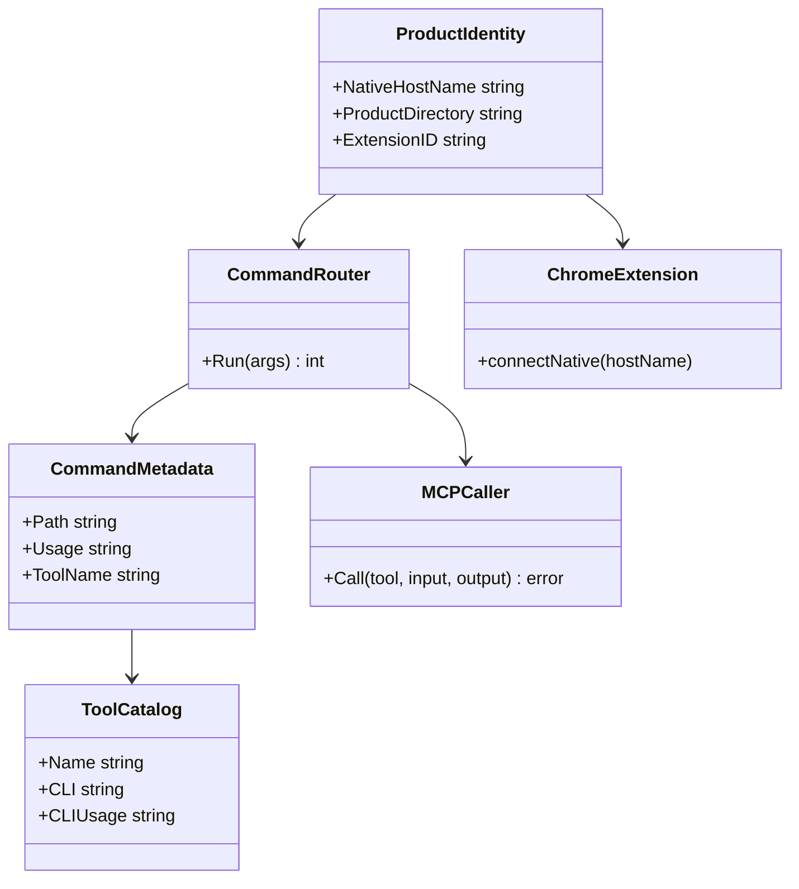
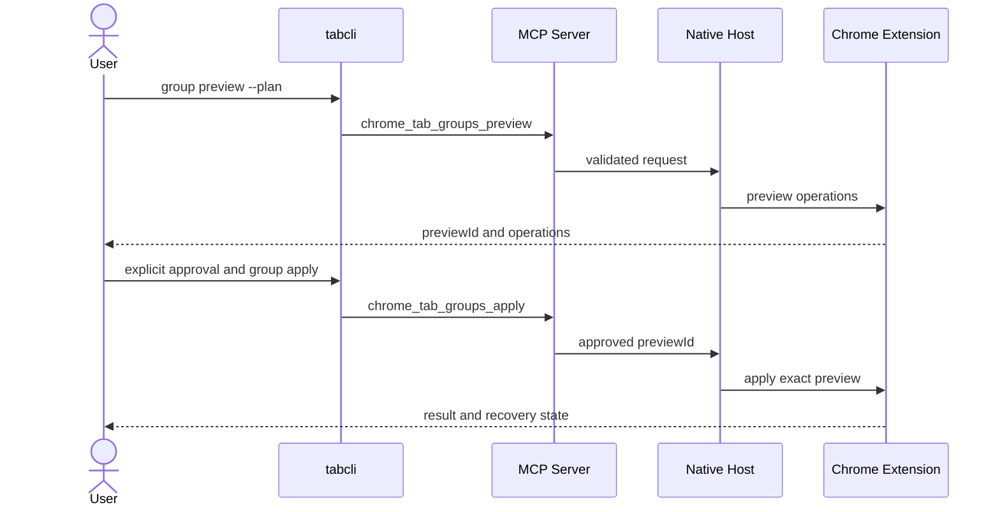

# tabcli名称統一とCLIフラット化 実装計画

準拠ガイド: https://github.com/masahide/llm-gate/blob/main/docs/AI_Planning_Guide.md

## 1. 概要と目的 Overview and Purpose

### What

`chrome-tab-organizer` と `tabctl` から `tabcli` への名称変更をコード上で完了させ、タブ操作CLIを次の公開コマンドへフラット化する。

```text
tabcli list
tabcli content TAB_ID
tabcli compare TAB_ID_A TAB_ID_B
tabcli diff TAB_ID_A TAB_ID_B
tabcli close --confirm TAB_ID...
tabcli group list
tabcli group preview --plan FILE
tabcli group apply --preview-id ID
tabcli group undo
```

管理コマンドの `install`、`uninstall`、`status`、`doctor`、`version` と、MCPプロキシの `mcp serve` は現行の階層を維持する。

### Why

- `tabcli tabs list` のようなtabの重複を解消し、短く直感的な操作体系にする。
- リポジトリ、実行ファイル、Skill、配布物、設定パス、Native Messaging識別子を `tabcli` へ統一する。
- 現在混在している新旧エントリーポイントとSkillを除去し、誤ったバイナリやSkillが使われる可能性をなくす。
- Chrome拡張とGo Native Hostで異なるホスト名を使っている現状を修正し、Native Messaging接続を成立させる。

### How

- 製品識別子を `internal/buildinfo` に集約し、インストール、discovery、署名、拡張、ドキュメントで同じ値を使用する。
- CLIの外部契約だけをフラット化し、MCPツール名、入出力型、Native Messagingプロトコルは変更しない。
- `internal/tools.Catalog` をCLIヘルプとMCPツール対応の正とし、dispatchと契約テストを更新する。
- TDDで新コマンドの失敗テストを先に追加し、最小限のdispatch変更後に重複を整理する。

### 現状調査で判明した差分

| 分類 | 現状 | 必要な対応 |
| --- | --- | --- |
| Go module | `github.com/masahide/tabcli` | 維持する |
| CLI entrypoint | `cmd/tabcli` と `cmd/tabctl` が併存 | `cmd/tabcli` のみにする |
| Skill | `skills/tabcli` と `skills/chrome-tab-organizer` が併存 | `skills/tabcli` のみにする |
| CLI体系 | `tabs` と `groups` のネスト型 | タブ操作をトップレベル化し、グループ操作を単数形 `group` 配下へ移す |
| Native Host | 拡張は `io.github.masahide.tabcli`、Goは `io.github.yamasaki_masahide_cyg.tabcli` | `io.github.masahide.tabcli` に統一する |
| 製品データ | `ChromeTabOrganizer` が残存 | `tabcli` に変更する |
| manifest template | 新旧2ファイルが併存し、実装から未参照 | 生成元をGo実装に一本化し、未使用templateを削除する |
| 旧実装計画 | 新旧2ファイルが併存 | 新版だけを残すか旧版を明確に廃止扱いにする |
| Chrome拡張ID | 公開鍵由来の `ddgfmgclndpdobieomcjaklboinbaoel` | 絶対に変更しない |

## 2. 仕様と受け入れ条件 Specification and Acceptance Criteria

### 2.1 スコープ Scope

#### 今回やること

- CLIコマンドをフラット化する。
- CLI metadata、help、usage、エラー文、テストfixtureを新コマンドへ更新する。
- リアルChrome統合テストを新コマンドへ更新する。
- Native Messaging Host名を `io.github.masahide.tabcli` に統一する。
- macOS製品ディレクトリを `~/Library/Application Support/tabcli` に統一する。
- discovery fileを `~/Library/Application Support/tabcli/runtime/discovery.json` に変更する。
- コード署名identifierを `io.github.masahide.tabcli.tabcli` に統一する。
- 旧ディレクトリ、旧template、旧実装計画の重複を解消する。
- README、要求仕様、利用ガイド、開発ガイド、Skillを新しいCLI契約へ更新する。
- 固定拡張IDと `manifest.json` の `key` が不変であることを契約テストで保護する。

#### 成果物

- 新CLI契約を実装したGoコード
- 名称と識別子を統一したChrome拡張とインストール処理
- 更新済みの単体、契約、統合テスト
- 更新済みのREADME、Skill、利用ガイド、要求仕様
- 旧版からの最小移行手順

#### 制約

- Go 1.25を使用する。
- Node.js 24と既存のTypeScript、Vitest構成を使用する。
- Chrome拡張IDを維持するため `extension/manifest.json` の `key` は変更しない。
- `chrome_*` で始まるMCPツール名とJSON schemaは変更しない。
- destructiveな `close` と `group apply` の承認契約は緩和しない。
- stdoutとstderrの既存分離、JSONエラー形式、終了コードを維持する。

### 2.2 非スコープ Non Scope

- WindowsとLinuxの新規対応
- Chrome Web Store公開
- Developer ID署名とnotarization
- MCPツール名の変更
- Native Messaging protocol versionの更新
- タブ重複の自動判定
- closeのUndo対応
- 旧 `tabctl` 実行ファイルや旧ネストコマンドの互換alias
- 旧製品ディレクトリからの設定自動移行

旧コマンドの互換aliasを設けないのは、プロトタイプ段階で新しい契約を単純に保つためである。破壊的変更は利用ガイドの移行表で明示する。

### 2.3 ユースケース Use Cases

#### UC-01 タブ一覧を取得する

ユーザーまたはAIエージェントが `tabcli --json list` を実行し、現在の非incognitoタブ一覧を取得する。

#### UC-02 タブ内容を比較する

ユーザーが `tabcli compare 123 456` を実行し、本文を返さずSHA-256の一致結果だけを取得する。

#### UC-03 タブを明示的に閉じる

ユーザーが対象IDを確認してから `tabcli close --confirm 123 456` を実行する。`--confirm` がなければ何も閉じない。

#### UC-04 グループ変更をpreviewして適用する

AIエージェントが `tabcli group preview --plan plan.json` を実行し、ユーザーが差分を明示承認した後だけ `tabcli group apply --preview-id ID` を実行する。

#### UC-05 Chromeが接続されていない

CLIは既存どおり `BROWSER_DISCONNECTED` と専用終了コードを返し、Chromeを自動起動しない。

#### UC-06 旧コマンドを実行する

`tabcli tabs list` と `tabcli groups list` は未知のコマンドとして扱う。JSONモードでは構造化された `INVALID_ARGUMENT` を返し、通常モードではusage終了とする。

#### UC-07 Native Hostを登録する

`tabcli install` は現在ユーザー向けに `io.github.masahide.tabcli.json` を作成し、Chrome拡張は同じホスト名で接続する。

### 2.4 受け入れ条件 Acceptance Criteria

1. Given ChromeとNative Hostが接続済み、When `tabcli --json list` を実行する、Then `chrome_tabs_list` と同じ結果schemaをstdoutへJSONだけで返す。
2. Given 2つの有効なtab ID、When `tabcli compare ID_A ID_B` を実行する、Then 本文を永続化せず既存のSHA-256比較結果を返す。
3. Given `--confirm` のないclose要求、When `tabcli --json close ID` を実行する、Then Chrome状態を変更せず `CONFIRMATION_REQUIRED` と対応する非0終了コードを返す。
4. Given 有効なplan、When `tabcli group preview` の結果を承認して `tabcli group apply` を実行する、Then preview時と同じ安全性契約で操作を適用する。
5. Given 新しい拡張と `tabcli install`、When ChromeがNative Messaging接続する、Then 拡張とmanifestの双方が `io.github.masahide.tabcli` を使用して接続に成功する。
6. Given ビルド済み拡張、When artifact検証を実行する、Then 拡張IDが `ddgfmgclndpdobieomcjaklboinbaoel` のままであり、公開鍵変更を検知した場合は失敗する。
7. Given リポジトリ全体、When旧名称検査と全テストを実行する、Then 許可した移行説明以外に `tabctl`、`chrome-tab-organizer`、`ChromeTabOrganizer`、旧Native Host名が残らない。

### 2.5 既知の制約 Known Limitations

- 旧バイナリと旧ネストコマンドは動作しない。
- 旧 `ChromeTabOrganizer` ディレクトリの設定とruntime fileは自動移行しない。
- Native Host名変更後は再度 `tabcli install` と拡張のreloadが必要になる。
- MCPツール名は製品名とは独立した既存APIとして `chrome_*` を維持する。
- `--json` の位置は既存実装どおりトップレベルとサブコマンド後の双方を受け入れる。

## 3. 前提技術スタック Context and Tech Stack

- Language Framework
  - Go 1.25
  - TypeScript
  - Chrome Extension Manifest V3
- Libraries
  - `github.com/modelcontextprotocol/go-sdk` v1.6.0
  - Go標準 `flag` package
  - Vitest
- Style Guide
  - 既存のGo package境界と命名規則に従う。
  - CLIのdispatchはKISSを優先し、追加frameworkを導入しない。
  - 製品識別子は `internal/buildinfo` を唯一の正とする。
- Runtime Deployment
  - macOS arm64
  - macOS amd64
  - Chrome 121以上
- Testing
  - `go test ./...`
  - `npm test`
  - `npm run typecheck`
  - `npm run build`
  - build tag `integration` を使うリアルChrome統合テスト

## 4. インターフェース契約 Interface Contracts

### 4.1 公開APIまたは外部I O一覧

#### CLI

| 新コマンド | 旧コマンド | MCP tool | 種別 |
| --- | --- | --- | --- |
| `tabcli list` | `tabcli tabs list` | `chrome_tabs_list` | Read only |
| `tabcli content TAB_ID` | `tabcli tabs content TAB_ID` | `chrome_tab_content_get` | Read only |
| `tabcli compare A B` | `tabcli tabs compare A B` | `chrome_tab_content_compare` | Read only |
| `tabcli diff A B` | `tabcli tabs diff A B` | `chrome_tab_content_diff` | Read only |
| `tabcli close --confirm ID...` | `tabcli tabs close --confirm ID...` | `chrome_tabs_close` | Destructive |
| `tabcli group list` | `tabcli groups list` | `chrome_tab_groups_list` | Read only |
| `tabcli group preview --plan FILE` | `tabcli groups preview --plan FILE` | `chrome_tab_groups_preview` | Read only |
| `tabcli group apply --preview-id ID` | `tabcli groups apply --preview-id ID` | `chrome_tab_groups_apply` | Mutating |
| `tabcli group undo` | `tabcli groups undo` | `chrome_tab_groups_undo` | Mutating |

`install`、`uninstall`、`status`、`doctor`、`version`、`mcp serve` は変更しない。

#### Native Messaging

- Host name: `io.github.masahide.tabcli`
- Manifest filename: `io.github.masahide.tabcli.json`
- Allowed origin: `chrome-extension://ddgfmgclndpdobieomcjaklboinbaoel/`
- Executable path: インストール済み `tabcli` の絶対パス
- Protocol version: 3を維持する

#### ファイルシステム

- CLI binary: `$HOME/.local/bin/tabcli`
- Release data: `$HOME/.local/share/tabcli/releases/VERSION`
- Product config: `$HOME/Library/Application Support/tabcli`
- Discovery file: `$HOME/Library/Application Support/tabcli/runtime/discovery.json`
- Native manifest: `$HOME/Library/Application Support/Google/Chrome/NativeMessagingHosts/io.github.masahide.tabcli.json`

#### MCP

MCP tool名、入力型、出力型、error dataは変更しない。CLIのroutingだけを変更する。

### 4.2 データモデルとスキーマ

- `tools.Catalog` の `CLI` と `CLIUsage` を新コマンドへ更新する。
- MCP入力と結果型は現行の `internal/tools` をそのまま利用する。
- JSON成功応答は現行の各result型を維持する。
- JSON失敗応答は次のschemaを維持する。

```json
{
  "error": {
    "code": "INVALID_ARGUMENT",
    "message": "unknown command",
    "retryable": false
  }
}
```

### 4.3 エラーと例外 Error Handling

- 未知のコマンド
  - 通常モードはstderrへusage情報を出し、`ExitUsage` を返す。
  - JSONモードはstdoutへ `INVALID_ARGUMENT` を返し、`ExitInvalidArgument` を返す。
- 引数不正
  - 現行のerror codeと終了コード対応を維持する。
- Chrome未接続
  - `BROWSER_DISCONNECTED` を返し、自動起動または自動retryをしない。
- close
  - `--confirm` を必須とし、指定された正確なIDだけを渡す。
- group apply
  - `--preview-id` を必須とし、自動retryしない。
- page content
  - untrusted dataとして扱う通知をstderrへ出し、Token、Cookie、private headerを出力しない。
- timeoutとretry
  - CLIでは現行MCP clientのtimeout方針を維持する。
  - 状態変更コマンドは自動retryしない。

### 4.4 代表的な例 Examples

#### タブ一覧

```bash
tabcli --json list --inactive-for 7d --sort last_accessed --sort-order asc
```

#### 内容比較

```bash
tabcli --json compare 123 456
```

#### 安全なグループ適用

```bash
tabcli --json group preview --plan plan.json
tabcli --json group apply --preview-id APPROVED_PREVIEW_ID
```

## 5. アーキテクチャと設計図 Architecture and Diagrams

### 5.1 図の選択方針

CLI、MCP、Native Host、Chrome拡張、インストール境界を跨ぐためクラス図を使用する。previewとapplyの安全性は処理順序が重要なためシーケンス図も追加する。

### 5.2 クラス図 Class Diagram



### 5.3 グループ適用シーケンス



## 6. テスト戦略 Test Strategy

### 6.1 テストの種類

#### Unit

- `internal/cli`
  - 各フラットコマンドが正しいMCP toolとinputへ変換されること
  - flag位置、tab ID、duration、sort、max charsの境界値
  - closeの `--confirm` 必須契約
  - group applyの `--preview-id` 必須契約
  - 旧ネストコマンドを拒否すること
- `internal/install` と `internal/discovery`
  - 新しいHost名、manifest名、製品ディレクトリ、discovery path
  - uninstallが新しい管理対象以外を削除しないこと
- `internal/release`
  - 新しいartifact名とコード署名identifier
  - 固定extension IDとmanifest key由来IDの一致

#### Integration

- Go CLIからMCP clientを経由し、既存MCP resultを新コマンドで取得する。
- リアルChromeテストで `install`、Native Messaging接続、`tabcli --json list`、stdio MCPを通す。
- release entrypointでarm64とamd64の成果物名、署名、ZIP内容、checksumを検証する。

#### Contract

- `tools.Catalog` とCLI helpが一致すること。
- Chrome拡張側host名とGo側 `buildinfo.NativeHostName` が一致すること。
- `extension/manifest.json` のkeyから算出したextension IDが固定値と一致すること。
- JSON成功schema、JSON error schema、終了コードが変更されていないこと。
- MCP tool名とschemaに差分がないこと。

### 6.2 カバレッジ対象

- 全15 CLI command metadata
- タブ5操作とグループ4操作のdispatch
- global `--json` とサブコマンド後の `--json`
- 0、負数、非数値、同一tab ID、過大duration
- Chrome未接続、権限不足、stale、preview期限切れ、partial apply
- manifest host名不一致
- 旧製品ディレクトリと無関係ファイルを削除しないuninstall境界
- manifest key変更とextension ID変更

## 7. 実装タスクリスト Implementation Plan

### Phase 1 設計とベースライン修復

- [ ] PLAN-001 本計画のCLI契約、Canonical identity、非スコープを確定する。対象は本計画書と `docs/requirements.md`
- [ ] PLAN-002 Red `internal/buildinfo`、`internal/install`、`internal/discovery` にCanonical identityの失敗テストを追加する
- [ ] PLAN-003 Green `internal/buildinfo/identity.go` に `io.github.masahide.tabcli` と製品directory `tabcli` を集約し、hard codeを置換する
- [ ] PLAN-004 Refactor `internal/install/paths.go` と `internal/discovery/paths.go` が共通identityからpathを構築するよう重複を除去する
- [ ] PLAN-005 Red `extension/src/service-worker.ts` とGo側host名の不一致を検知するcontract testを追加する
- [ ] PLAN-006 Green `internal/release/build.go` のコード署名identifierを `io.github.masahide.tabcli.tabcli` に統一する
- [ ] PLAN-007 Contract `extension/manifest.json` のkeyと固定extension IDが変更されていないことを確認する

### Phase 2 CLIフラット化

- [ ] CLI-001 Red `internal/cli/agent_patterns_test.go` に `list`、`content`、`compare`、`diff`、`close` のrouting testを追加する
- [ ] CLI-002 Red 同テストに `group list`、`group preview`、`group apply`、`group undo` のrouting testを追加する
- [ ] CLI-003 Red 旧 `tabs` と `groups` を通常モードとJSONモードの双方で拒否するtestを追加する
- [ ] CLI-004 Green `internal/cli/cli.go` のdispatchを新コマンドへ変更し、既存handlerへ最小限のroutingを行う
- [ ] CLI-005 Green 各 `flag.NewFlagSet`、usage error、help contextを新しいコマンド名へ更新する
- [ ] CLI-006 Refactor dispatchとmetadataのcommand文字列重複を点検し、必要最小限のhelperへ整理する
- [ ] CLI-007 Contract `internal/tools/catalog.go` の `CLI` と `CLIUsage` を新契約へ更新する
- [ ] CLI-008 Contract `internal/cli/testdata/help.golden` と `internal/cli/golden_test.go` を更新する
- [ ] CLI-009 Safety closeの確認必須、preview承認、apply非retryの既存testを維持し、新command pathで再実行する

### Phase 3 Skillと統合コードの更新

- [ ] INT-001 Red `internal/skill/testdata/workflows.json` を新コマンドへ更新し、既存Skill testが失敗することを確認する
- [ ] INT-002 Green `skills/tabcli/SKILL.md`、`references/plan-format.md`、`agents/openai.yaml` を新CLI契約へ更新する
- [ ] INT-003 Safety Skillがclose前のID再取得と明示承認、apply前のpreview提示を要求し続けることをtestで確認する
- [ ] INT-004 Integration `integration/real_chrome_test.go` のCLI呼び出しを `tabcli --json list` へ更新する
- [ ] INT-005 Integration Native Messaging manifest、Chrome拡張host名、Go host名を揃えた状態でリアルChrome接続を検証する
- [ ] INT-006 Release `internal/release/build.go` のINSTALL文とテストを新コマンドへ更新する

### Phase 4 旧構造の除去

- [ ] CLEAN-001 `cmd/tabctl` を削除し、build対象が `cmd/tabcli` のみであることを確認する
- [ ] CLEAN-002 `skills/chrome-tab-organizer` を削除し、Skill testの参照先を `skills/tabcli` のみにする
- [ ] CLEAN-003 未使用の `packaging/*.json.tmpl` を削除し、Native manifest生成元を `internal/install` に一本化する
- [ ] CLEAN-004 `docs/260718_chrome_tab_organizer_implementation.md` を削除するか、履歴として残す場合はsuperseded表記を付けて通常導線から外す
- [ ] CLEAN-005 `rg` で旧名称を検査し、移行説明以外の `tabctl`、`chrome-tab-organizer`、`ChromeTabOrganizer`、`yamasaki_masahide_cyg` を0件にする
- [ ] CLEAN-006 `go list ./...` で重複entrypointや意図しないpackageがないことを確認する

### Phase 5 ドキュメントと移行ガイド

- [ ] DOC-001 `README.md` のネスト型維持説明を削除し、新コマンド例と安全性説明へ更新する
- [ ] DOC-002 `docs/getting-started.md` の全実行例とNative Host再登録手順を更新する
- [ ] DOC-003 `docs/development.md` のbuild、release、動作確認例を更新する
- [ ] DOC-004 `docs/requirements.md` のUC、SYS、CLI、DIST、SKILL要件を新契約へ更新する
- [ ] DOC-005 `docs/260718_tabcli_implementation.md` と `docs/260718_macos_verification.md` の古いコマンド例、identity、pathを更新する
- [ ] DOC-006 旧版からの最小移行として、旧Native manifestと旧製品directoryを確認してから新 `tabcli install` を実行する手順を記載する

### Phase 6 統合と検証

- [ ] VERIFY-001 `gofmt` と既存formatterを実行する
- [ ] VERIFY-002 `go test ./...` を実行する
- [ ] VERIFY-003 `npm ci`、`npm test`、`npm run typecheck`、`npm run build` を実行する
- [ ] VERIFY-004 リアルChrome統合テストを実行し、Native Host、HTTP MCP、CLI、stdio MCPを確認する
- [ ] VERIFY-005 release entrypointでdarwin arm64とamd64の成果物を生成し、署名、ZIP、checksum、version整合を確認する
- [ ] VERIFY-006 `tabcli --help` と各commandの `--help` を確認する
- [ ] VERIFY-007 JSON stdoutへ診断文が混入せず、stderrへ秘密情報が出ないことを確認する
- [ ] VERIFY-008 docsとSkillに記載した全コマンド例をsmoke testする

## 8. 完了の定義 Definition of Done

### 8.1 機能DoD Functional DoD

- [ ] 受け入れ条件7件がすべて満たされている
- [ ] タブ操作はトップレベル、グループ操作は `group` 配下で実行できる
- [ ] 旧ネストコマンドが意図したエラー契約で拒否される
- [ ] Chrome拡張とNative Hostが `io.github.masahide.tabcli` で接続できる
- [ ] MCP tool名、schema、Native Messaging protocol versionが変わっていない
- [ ] closeとgroup applyの安全性契約が維持されている
- [ ] 固定extension IDが維持されている

### 8.2 品質DoD Quality DoD

- [ ] Go、TypeScript、contract、integration testがすべてパスしている
- [ ] Linter、formatter、typecheckのエラーがない
- [ ] release成果物の署名とchecksum検証が成功する
- [ ] 旧entrypoint、旧Skill、未使用templateが残っていない
- [ ] 許可した移行説明以外に旧名称が残っていない
- [ ] README、要求仕様、利用ガイド、Skill、help goldenが同じCLI契約を示している
- [ ] 不要なdebug codeと生成途中のartifactが削除されている

## 9. 懸念事項と未確定事項 Concerns and Questions

### 確定推奨事項

- GitHub ownerとGo moduleが `masahide` で統一済みのため、Native Host名は `io.github.masahide.tabcli` を採用する。
- macOS製品ディレクトリはプロダクト名と揃えて小文字の `tabcli` を採用する。
- タブ操作は完全フラット化し、グループ操作は衝突を避けるため単数形の `group` 配下へ置く。
- MCP tool名は外部APIとして維持する。
- 旧CLI aliasは追加しない。

### 技術的な懸念

- Native Host名不一致は現時点の接続阻害要因であり、CLIフラット化より先に修正と契約テストが必要である。
- 製品ディレクトリ変更により、旧runtime discovery fileとsettingsは参照されなくなる。
- 旧Native manifestが残るとChrome設定に不要な登録が残る。自動削除は誤削除リスクがあるため、プロトタイプでは手動移行手順を優先する。
- `tools.Catalog` のCLI文字列と `Command.Run` のdispatchが別実装なので、contract testを強化しないと再びdriftする可能性がある。
- ドキュメントとSkillのコマンド例が多いため、単純な文字列置換だけでなく、実行可能なsmoke testが必要である。

### 実装開始前に最終確認する事項

- `io.github.masahide.tabcli` をCanonical Native Host名として確定するか。
- `~/Library/Application Support/tabcli` をCanonical製品ディレクトリとして確定するか。
- 旧実装計画を削除するか、履歴としてsuperseded表記で残すか。
- 旧Native manifestと旧製品directoryの自動削除を行わず、移行手順だけで扱う方針でよいか。
