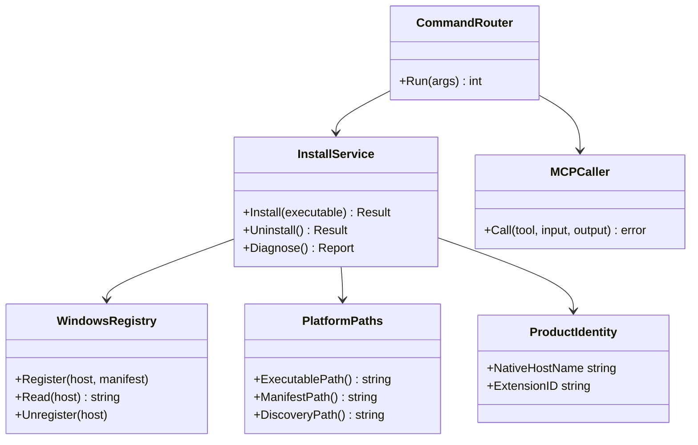
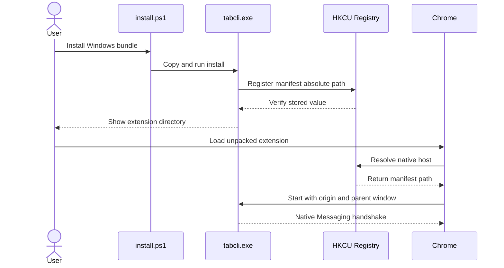

# tabcli Windows先行対応とCLIフラット化 実装計画

準拠ガイド: https://github.com/masahide/llm-gate/blob/main/docs/AI_Planning_Guide.md

Windows Native Messaging仕様: https://developer.chrome.com/docs/extensions/develop/concepts/native-messaging

## 1. 概要と目的 Overview and Purpose

### What

現在macOS向けに実装されている `tabcli` を、Windows 11 x64とGoogle Chrome Stableで最初に利用できる状態へ変更する。そのうえで、`tabcli tabs list` のような重複を解消し、次の公開CLIへフラット化する。

```text
tabcli.exe list
tabcli.exe content TAB_ID
tabcli.exe compare TAB_ID_A TAB_ID_B
tabcli.exe diff TAB_ID_A TAB_ID_B
tabcli.exe close --confirm TAB_ID...
tabcli.exe group list
tabcli.exe group preview --plan FILE
tabcli.exe group apply --preview-id ID
tabcli.exe group undo
```

管理コマンドの `install`、`uninstall`、`status`、`doctor`、`version` と、MCPプロキシの `mcp serve` は現行の階層を維持する。

### Why

- 現在の実装環境であるWindows上で、開発、テスト、インストール、Chrome統合、Release作成まで完結できるようにする。
- Windows版を先に動作可能にし、日常の開発サイクルで実機検証できる状態にする。
- `tabcli tabs list` のようなtabの重複を解消し、短く直感的なCLIにする。
- リポジトリ、実行ファイル、Skill、配布物、設定パス、Native Messaging識別子を `tabcli` へ統一する。
- Chrome拡張とGo Native Hostで異なっているホスト名を修正し、Native Messaging接続を成立させる。

### How

1. 製品識別子とOS別pathの境界を整理する。
2. WindowsのNative Messaging登録とdiscovery fileを実装する。
3. Windows amd64向けのビルドとPowerShellインストーラーを作る。
4. Windows上のリアルChrome統合テストを成立させる。
5. CLIをフラット化し、Skillとドキュメントを更新する。
6. macOSは既存コードを壊さない範囲で維持し、本格的な再検証と配布更新はWindows MVP完了後に行う。

### 実装優先順位

| 優先度 | 対象 | 完了条件 |
| --- | --- | --- |
| P0 | Windows Native Messaging | HKCU登録からChrome拡張と `tabcli.exe` が接続できる |
| P0 | Windows discoveryとCLI | Chrome接続後にWindows上でCLIとstdio MCPを利用できる |
| P0 | Windows Release | windows amd64 ZIPとPowerShellインストーラーを生成できる |
| P1 | CLIフラット化 | 新コマンドで全操作を実行でき、旧ネスト型を拒否できる |
| P1 | 名称と重複の整理 | 新旧entrypoint、Skill、識別子の混在がなくなる |
| P2 | macOS再検証 | Windows MVP後に既存darwinテストとReleaseを更新する |

### 現状調査で判明した差分

| 分類 | 現状 | 必要な対応 |
| --- | --- | --- |
| OS判定 | `internal/install` と `internal/discovery` がdarwin以外を拒否 | Windows実装をbuild tagで追加する |
| Native Messaging登録 | macOSのmanifest配置のみ | HKCUレジストリとWindows用manifest配置を実装する |
| Native Host起動引数 | macOS originのみを想定したコメントとtest | Windowsの `--parent-window` 追加引数を許容する |
| Release | darwin arm64とamd64、codesign、shell installerのみ | windows amd64、`tabcli.exe`、PowerShell installerを先行実装する |
| 統合テスト | macOS限定と固定Chrome path | WindowsのChrome path探索とHKCU登録を実装する |
| Go module | `github.com/masahide/tabcli` | 維持する |
| CLI entrypoint | `cmd/tabcli` と `cmd/tabctl` が併存 | `cmd/tabcli` のみにする |
| Skill | `skills/tabcli` と `skills/chrome-tab-organizer` が併存 | `skills/tabcli` のみにする |
| CLI体系 | `tabs` と `groups` のネスト型 | タブ操作をトップレベル化し、グループ操作を単数形 `group` 配下へ移す |
| Native Host | 拡張は `io.github.masahide.tabcli`、Goは `io.github.yamasaki_masahide_cyg.tabcli` | `io.github.masahide.tabcli` に統一する |
| 製品データ | `ChromeTabOrganizer` が残存 | Windowsでは `%LOCALAPPDATA%\tabcli` に統一する |
| Chrome拡張ID | 公開鍵由来の `ddgfmgclndpdobieomcjaklboinbaoel` | 絶対に変更しない |

## 2. 仕様と受け入れ条件 Specification and Acceptance Criteria

### 2.1 スコープ Scope

#### 今回やること

- Windows 11 x64とChrome Stableを最初の実装、検証、配布対象にする。
- `tabcli.exe install` で現在ユーザーのHKCUへNative Messaging Hostを登録する。
- `tabcli.exe uninstall` で本製品が管理するHKCUキー、manifest、runtime、settingsだけを削除する。
- `%LOCALAPPDATA%\tabcli` 配下へmanifest、runtime、settings、Release展開物を配置する。
- Windowsで渡されるoriginと `--parent-window` をNative Host起動として認識する。
- Windows amd64向け `tabcli.exe` とRelease ZIPを生成する。
- `install.ps1` と `install-with-gh.ps1` を追加する。
- Windows実機上でNative Host、HTTP MCP、CLI、stdio MCPの統合テストを実行する。
- CLIコマンドをフラット化する。
- Native Host名を `io.github.masahide.tabcli` に統一する。
- 新旧ディレクトリ、未使用template、旧名称の重複を解消する。
- README、要求仕様、Windows利用ガイド、開発ガイド、Skillを更新する。
- 固定拡張IDと `manifest.json` の `key` が不変であることを契約テストで保護する。

#### 成果物

- Windows対応したGoコード
- `tabcli.exe`
- `tabcli-VERSION-windows-amd64.zip`
- `tabcli-extension.zip`
- `install.ps1`
- `install-with-gh.ps1`
- Windows用の単体、契約、統合テスト
- 新CLI契約を反映したREADME、Skill、要求仕様、利用ガイド
- macOSを後続対応へ戻すための残タスク

#### 制約

- 開発と実機テストはWindows 11 x64を基準にする。
- Go 1.25とNode.js 24を使用する。
- Chrome Stable 121以上を対象とする。
- インストールは管理者権限を要求せず、現在ユーザーのHKCUとLOCALAPPDATAだけを使用する。
- Chrome拡張IDを維持するため `extension/manifest.json` の `key` は変更しない。
- `chrome_*` で始まるMCPツール名とJSON schemaは変更しない。
- destructiveな `close` と `group apply` の承認契約は緩和しない。
- stdoutとstderrの分離、JSONエラー形式、終了コードを維持する。

### 2.2 非スコープ Non Scope

- Windows arm64とWindows 32 bit対応
- MSI、MSIX、winget、Chocolateyによる配布
- Authenticode署名
- Microsoft EdgeとChromiumへの登録
- Windows Service化
- Chrome Web Store公開
- Linux対応
- macOS版の新機能開発、notarization、配布再検証
- MCPツール名とNative Messaging protocol versionの変更
- 旧 `tabctl` と旧ネストコマンドの互換alias
- 旧macOS製品ディレクトリからWindowsへの設定移行

macOSコードは削除しない。Windows MVPの変更で既存Go testを壊さないことだけを今回の品質条件とし、macOS実機検証とRelease更新は後続計画へ分離する。

### 2.3 ユースケース Use Cases

#### UC-01 Windowsへインストールする

ユーザーがPowerShellで `install.ps1` を実行する。スクリプトは現在ユーザー領域へ `tabcli.exe` と拡張を配置し、`tabcli.exe install` を通じてHKCUへNative Messaging Hostを登録する。

#### UC-02 Chrome拡張がNative Hostを起動する

Chrome拡張が `chrome.runtime.connectNative("io.github.masahide.tabcli")` を呼び出す。ChromeはHKCUからmanifest pathを解決し、`tabcli.exe` にextension originと `--parent-window` を渡して起動する。

#### UC-03 タブ一覧を取得する

ユーザーまたはAIエージェントが `tabcli.exe --json list` を実行し、現在の非incognitoタブ一覧を取得する。

#### UC-04 タブを明示的に閉じる

ユーザーが対象IDを確認し、`tabcli.exe close --confirm 123 456` を実行する。`--confirm` がなければ何も閉じない。

#### UC-05 グループ変更をpreviewして適用する

AIエージェントが `tabcli.exe group preview --plan plan.json` を実行し、ユーザーが差分を明示承認した後だけ `tabcli.exe group apply --preview-id ID` を実行する。

#### UC-06 Chromeが接続されていない

CLIは `BROWSER_DISCONNECTED` と専用終了コードを返し、Chromeを自動起動しない。

#### UC-07 旧コマンドを実行する

`tabcli.exe tabs list` と `tabcli.exe groups list` は未知のコマンドとして扱う。JSONモードでは構造化された `INVALID_ARGUMENT` を返し、通常モードではusage終了とする。

#### UC-08 実行中バイナリを更新しようとする

Chromeが旧 `tabcli.exe` を使用中で配置先を置換できない場合、PowerShell installerは強制終了や部分更新を行わず、Chromeを完全終了して再実行するよう明示して失敗する。

### 2.4 受け入れ条件 Acceptance Criteria

1. Given Windows 11 x64の現在ユーザー、When `tabcli.exe install` を実行する、Then HKCUの所定キーの既定値がmanifestの絶対pathになり、manifestの `path` がインストール済み `tabcli.exe` を指す。
2. Given Windowsへ登録済みのNative Host、When Chrome拡張が接続する、Then originと `--parent-window` を受け入れてNative Host modeで起動し、protocol handshakeが成功する。
3. Given ChromeとNative Hostが接続済み、When `tabcli.exe --json list` を実行する、Then `chrome_tabs_list` と同じresult schemaをstdoutへJSONだけで返す。
4. Given `--confirm` のないclose要求、When `tabcli.exe --json close ID` を実行する、Then Chrome状態を変更せず `CONFIRMATION_REQUIRED` と対応する非0終了コードを返す。
5. Given 有効なplan、When `group preview` の結果を承認して `group apply` を実行する、Then preview時と同じ安全性契約で操作を適用する。
6. Given Windows Release command、When windows amd64成果物を生成する、Then `tabcli.exe`、拡張ZIP、PowerShell installer、version metadata、checksumを含む再現可能なZIPを生成する。
7. Given ビルド済み拡張、When artifact検証を実行する、Then拡張IDが `ddgfmgclndpdobieomcjaklboinbaoel` のままであり、公開鍵変更時は失敗する。

### 2.5 既知の制約 Known Limitations

- Windows amd64だけを最初の配布対象とする。
- Windows版は初期段階では未署名のため、SmartScreen警告が表示される可能性がある。
- インストール先の `tabcli.exe` がChromeから実行中の場合、更新前にChromeの完全終了が必要になる。
- installerはChromeを強制終了せず、ユーザーへ終了と再実行を求める。
- 拡張機能のunpacked loadはChrome UIから手動で行う。
- installerはユーザーPATHを自動変更しない。完了時に実行ファイルの絶対pathを表示する。
- macOSの実機検証と配布更新はWindows MVP完了後に行う。
- MCPツール名は既存APIとして `chrome_*` を維持する。

## 3. 前提技術スタック Context and Tech Stack

- Language Framework
  - Go 1.25
  - TypeScript
  - PowerShell 5.1以上
  - Chrome Extension Manifest V3
- Libraries
  - `github.com/modelcontextprotocol/go-sdk` v1.6.0
  - `golang.org/x/sys/windows/registry`
  - Go標準 `flag` package
  - Vitest
  - Puppeteer Core
- Style Guide
  - OS固有処理はbuild tag付きファイルへ分離する。
  - shared logicから直接registry APIを呼ばず、Windows登録処理の境界を明確にする。
  - 製品識別子は `internal/buildinfo` を唯一の正とする。
  - CLI dispatchはKISSを優先し、新しいCLI frameworkを導入しない。
- Runtime Deployment
  - Windows 11 x64
  - Google Chrome Stable 121以上
  - HKCUによるcurrent user install
- Testing
  - Windows上の `go test ./...`
  - `npm test`
  - `npm run typecheck`
  - `npm run build`
  - build tag `integration` を使うリアルChrome統合テスト

## 4. インターフェース契約 Interface Contracts

### 4.1 公開APIまたは外部I O一覧

#### CLI

| 新コマンド | 旧コマンド | MCP tool | 種別 |
| --- | --- | --- | --- |
| `tabcli.exe list` | `tabcli.exe tabs list` | `chrome_tabs_list` | Read only |
| `tabcli.exe content TAB_ID` | `tabcli.exe tabs content TAB_ID` | `chrome_tab_content_get` | Read only |
| `tabcli.exe compare A B` | `tabcli.exe tabs compare A B` | `chrome_tab_content_compare` | Read only |
| `tabcli.exe diff A B` | `tabcli.exe tabs diff A B` | `chrome_tab_content_diff` | Read only |
| `tabcli.exe close --confirm ID...` | `tabcli.exe tabs close --confirm ID...` | `chrome_tabs_close` | Destructive |
| `tabcli.exe group list` | `tabcli.exe groups list` | `chrome_tab_groups_list` | Read only |
| `tabcli.exe group preview --plan FILE` | `tabcli.exe groups preview --plan FILE` | `chrome_tab_groups_preview` | Read only |
| `tabcli.exe group apply --preview-id ID` | `tabcli.exe groups apply --preview-id ID` | `chrome_tab_groups_apply` | Mutating |
| `tabcli.exe group undo` | `tabcli.exe groups undo` | `chrome_tab_groups_undo` | Mutating |

`install`、`uninstall`、`status`、`doctor`、`version`、`mcp serve` は変更しない。

#### Windows Native Messaging

- Host name: `io.github.masahide.tabcli`
- Registry key: `HKCU\Software\Google\Chrome\NativeMessagingHosts\io.github.masahide.tabcli`
- Registry default value: Native Messaging manifestの絶対path
- Manifest path: `%LOCALAPPDATA%\tabcli\native-messaging\io.github.masahide.tabcli.json`
- Manifest executable path: `%LOCALAPPDATA%\Programs\tabcli\tabcli.exe`
- Allowed origin: `chrome-extension://ddgfmgclndpdobieomcjaklboinbaoel/`
- Protocol: stdinとstdoutによるlength-prefixed JSON
- Protocol version: 3を維持する

manifestの `path` はWindowsでは相対pathも許されるが、登録状態を明確に診断できるよう絶対pathを採用する。

#### Windowsファイルシステム

- CLI binary: `%LOCALAPPDATA%\Programs\tabcli\tabcli.exe`
- Product data: `%LOCALAPPDATA%\tabcli`
- Release data: `%LOCALAPPDATA%\tabcli\releases\VERSION`
- Extension directory: `%LOCALAPPDATA%\tabcli\releases\VERSION\tabcli-extension-unpacked`
- Discovery file: `%LOCALAPPDATA%\tabcli\runtime\discovery.json`
- Settings file: `%LOCALAPPDATA%\tabcli\settings.json`

#### Windows Release

```text
tabcli-VERSION-windows-amd64.zip
├── tabcli.exe
├── tabcli-extension.zip
├── INSTALL.txt
├── install.ps1
└── version.json
```

Release assetsにはbundle ZIP、`install-with-gh.ps1`、`SHA256SUMS` を含める。

#### MCP

MCP tool名、input、output、error dataは変更しない。OS対応とCLI routingだけを変更する。

### 4.2 データモデルとスキーマ

#### Native Messaging manifest

```json
{
  "name": "io.github.masahide.tabcli",
  "description": "tabcli Native Messaging Host",
  "path": "C:\\Users\\USER\\AppData\\Local\\Programs\\tabcli\\tabcli.exe",
  "type": "stdio",
  "allowed_origins": [
    "chrome-extension://ddgfmgclndpdobieomcjaklboinbaoel/"
  ]
}
```

#### Windows登録結果

`install` のJSON結果はWindowsでも既存fieldを維持し、追加情報は後方追加とする。

```json
{
  "manifestPath": "C:\\Users\\USER\\AppData\\Local\\tabcli\\native-messaging\\io.github.masahide.tabcli.json",
  "registryKey": "HKCU\\Software\\Google\\Chrome\\NativeMessagingHosts\\io.github.masahide.tabcli"
}
```

既存の `manifestPath` を残すため、Go側のinstall callbackはstringだけでなくresult型を返せるよう最小限の型変更が必要になる。人間向け出力はmanifestとregistryの双方を表示する。

#### CLIとMCP

- `tools.Catalog` の `CLI` と `CLIUsage` を新コマンドへ更新する。
- MCP入力とresult型は現行の `internal/tools` を維持する。
- JSON error schemaと終了コード対応を維持する。

### 4.3 エラーと例外 Error Handling

- Registry access denied
  - HKLMへfallbackしない。
  - `REGISTRATION_FAILED` 相当のinstall errorとして返し、管理者権限を要求しない。
- Manifest write failure
  - registryを更新しない。temporary fileを削除する。
- Registry write後の検証失敗
  - 今回作成した値だけをrollbackし、失敗を返す。
- Binary in use
  - PowerShell installerはChromeや `tabcli.exe` を強制終了しない。
  - 更新前の状態を維持して失敗し、Chrome完全終了後の再実行を案内する。
- Unknown command
  - 通常モードはstderrへusageを出し `ExitUsage` を返す。
  - JSONモードはstdoutへ `INVALID_ARGUMENT` を返し `ExitInvalidArgument` を返す。
- Chrome disconnected
  - `BROWSER_DISCONNECTED` を返し、自動起動または自動retryをしない。
- close
  - `--confirm` を必須とし、指定された正確なIDだけを渡す。
- group apply
  - `--preview-id` を必須とし、自動retryしない。
- page content
  - untrusted dataとして扱う通知をstderrへ出し、Token、Cookie、private headerを出力しない。
- Native Messaging frame
  - Windowsでもlittle endianの32 bit lengthを使用する。
  - stdoutへMCPまたはNative Messaging frame以外を出さない。
  - 改行を含むpayloadがCRLF変換されないことをWindows統合テストで確認する。

### 4.4 代表的な例 Examples

#### ソースからWindows binaryを作る

```powershell
$env:CGO_ENABLED = "0"
$env:GOOS = "windows"
$env:GOARCH = "amd64"
go build -o .\dist\tabcli.exe .\cmd\tabcli
```

#### Native Hostを登録する

```powershell
& "$env:LOCALAPPDATA\Programs\tabcli\tabcli.exe" install
```

#### タブ一覧を取得する

```powershell
& "$env:LOCALAPPDATA\Programs\tabcli\tabcli.exe" --json list --inactive-for 7d
```

#### グループ変更をpreviewする

```powershell
tabcli.exe --json group preview --plan .\plan.json
```

## 5. アーキテクチャと設計図 Architecture and Diagrams

### 5.1 図の選択方針

Windows installer、registry、manifest、Native Host、CLI、MCP、Chrome拡張を跨ぐためクラス図を使用する。WindowsのNative Host起動順序が重要なためシーケンス図も追加する。

### 5.2 クラス図 Class Diagram



### 5.3 Windows Native Messaging起動シーケンス



## 6. テスト戦略 Test Strategy

### 6.1 テストの種類

#### Unit

- `internal/app`
  - extension originだけの起動
  - originと `--parent-window=0` があるWindows起動
  - 未許可originの拒否
- `internal/install`
  - LOCALAPPDATAからのWindows path組み立て
  - manifestの絶対exe path
  - registry interfaceをfake化したregister、verify、rollback、unregister
  - unmanaged registry keyとpathを削除しないこと
- `internal/discovery`
  - `%LOCALAPPDATA%\tabcli\runtime\discovery.json`
  - permissionとstale判定の既存契約
- `internal/cli`
  - 各フラットコマンドから正しいMCP toolとinputへの変換
  - closeの `--confirm` とgroup applyの `--preview-id`
  - 旧ネストコマンドの拒否
- `internal/release`
  - Windows artifact名とZIP内容
  - `.exe`とPowerShell installerの必須検証
  - 固定extension ID

#### Integration

- 一時的なHKCU test keyを作成し、既定値のwrite、read、deleteを実Windowsで確認する。
- `tabcli.exe install` からmanifestとregistryを作り、`doctor` で整合を確認する。
- Windows版Chrome Stableにunpacked extensionを読み込み、Native Messagingを起動する。
- HTTP MCP、`tabcli.exe --json list`、stdio MCPの結果を比較する。
- 改行を含むNative Messaging payloadでframe破損がないことを確認する。
- テスト終了時は作成したregistry key、manifest、runtime、Chrome test profileだけを削除する。

#### Contract

- Chrome拡張側host名、Go側 `NativeHostName`、registry key末尾、manifest nameが一致すること。
- `tools.Catalog` とCLI helpが一致すること。
- manifest keyから算出したextension IDが固定値と一致すること。
- JSON success、JSON error、終了コードが変更されていないこと。
- MCP tool名とschemaに差分がないこと。

### 6.2 カバレッジ対象

- Windows current user installとuninstall
- registry key不在、値不一致、access denied、rollback
- LOCALAPPDATA未設定または取得失敗
- pathに空白と日本語を含むWindows user profile
- Windows origin引数と `--parent-window`
- 全15 CLI command metadata
- タブ5操作とグループ4操作のdispatch
- global `--json` とサブコマンド後の `--json`
- Chrome未接続、権限不足、stale、preview期限切れ、partial apply
- 実行中binaryの更新失敗
- manifest key変更とextension ID変更

## 7. 実装タスクリスト Implementation Plan

### Phase 1 Windows対応の設計とベースライン

- [ ] WIN-001 Windows 11 x64、Chrome Stable、HKCU current user installをMVP契約として確定する
- [ ] WIN-002 Canonical identityを `github.com/masahide/tabcli`、`io.github.masahide.tabcli`、固定extension IDとして確定する
- [ ] WIN-003 Red `internal/app/mode_test.go` にWindowsのoriginと `--parent-window` を含む起動testを追加する
- [ ] WIN-004 Green `DetectMode` のOS依存コメントを修正し、Windows追加引数を安全に許容する
- [ ] WIN-005 Red Windows pathの失敗testを追加する。対象は `internal/install` と `internal/discovery`
- [ ] WIN-006 Green OS別pathを `*_windows.go` と `*_darwin.go` に分割し、shared logicからruntime分岐を除去する
- [ ] WIN-007 Refactor product identityとpath componentの重複を `internal/buildinfo` へ集約する

### Phase 2 Windows Native Messaging登録

- [ ] REG-001 Red registry操作をfake化できるinterfaceとregister、verify、rollback、unregisterのtestを追加する
- [ ] REG-002 Green `golang.org/x/sys/windows/registry` を使いHKCUのNativeMessagingHostsへ既定値を書き込む
- [ ] REG-003 Green `%LOCALAPPDATA%\tabcli\native-messaging` へmanifestをtemporary fileから原子的に配置する
- [ ] REG-004 Green registry既定値がmanifestの絶対pathと一致することをread backして検証する
- [ ] REG-005 Red `doctor` がexe、manifest、registry、discovery、Chrome、MCPを個別checkとして返すtestを追加する
- [ ] REG-006 Green Windows registration checkを `doctor` へ追加する
- [ ] REG-007 Red uninstallがcanonical registry keyとmanaged fileだけを削除するtestを追加する
- [ ] REG-008 Green Windows uninstallを実装し、他製品、他host、developer fileを保持する
- [ ] REG-009 Contract Go、Chrome拡張、manifest、registry keyのhost名一致testを追加する

### Phase 3 Windows ReleaseとPowerShell installer

- [ ] REL-001 Red release target `windows-amd64` のartifact構成testを追加する
- [ ] REL-002 Green `cmd/release` に明示的な `--target windows-amd64` を追加する
- [ ] REL-003 Green `CGO_ENABLED=0 GOOS=windows GOARCH=amd64` で `tabcli.exe` を生成する
- [ ] REL-004 Green Windows bundle ZIP、extension ZIP、version metadata、SHA256SUMSを生成する
- [ ] REL-005 Red `install.ps1` の必須file、version一致、checksum、配置先、失敗時非破壊性のtestを追加する
- [ ] REL-006 Green `install.ps1` を実装し、Chrome実行中のbinary置換失敗を明示して安全に中断する
- [ ] REL-007 Green `install-with-gh.ps1` を実装し、GitHub Releaseからwindows amd64 assetとchecksumを取得して検証する
- [ ] REL-008 Docs 未署名binaryとSmartScreen警告、Chrome完全終了、手動extension loadをINSTALLへ記載する
- [ ] REL-009 Refactor darwinのcodesignとshell installerをOS別release builderへ隔離し、Windows buildから呼ばない

### Phase 4 WindowsリアルChrome統合

- [ ] E2E-001 WindowsのChrome pathをProgram Files、Program Files x86、LOCALAPPDATAの順で解決するhelperを追加する
- [ ] E2E-002 `integration/real_chrome_test.go` のmacOS固定条件をOS別launcherとregistrationへ分離する
- [ ] E2E-003 一時HKCU registrationとChrome test profileを使用するWindows integration testを追加する
- [ ] E2E-004 Native Host handshakeとdiscovery file生成をWindowsで確認する
- [ ] E2E-005 HTTP MCPと既存CLIによるタブ一覧取得をWindowsで確認する
- [ ] E2E-006 stdio MCP proxyをWindowsで起動し、同じresultを取得する
- [ ] E2E-007 改行を含むframe round tripを実行し、CRLF変換による破損がないことを確認する
- [ ] E2E-008 cleanupでtest用registry key、manifest、runtime、Chrome profileだけを削除する

### Phase 5 CLIフラット化

- [ ] CLI-001 Red `list`、`content`、`compare`、`diff`、`close` のrouting testを追加する
- [ ] CLI-002 Red `group list`、`group preview`、`group apply`、`group undo` のrouting testを追加する
- [ ] CLI-003 Red 旧 `tabs` と `groups` を通常モードとJSONモードの双方で拒否するtestを追加する
- [ ] CLI-004 Green `internal/cli/cli.go` のdispatchを新コマンドへ変更し、既存handlerへroutingする
- [ ] CLI-005 Green `flag.NewFlagSet`、usage error、help contextを新コマンド名へ更新する
- [ ] CLI-006 Contract `internal/tools/catalog.go` の `CLI` と `CLIUsage` を新契約へ更新する
- [ ] CLI-007 Contract help goldenとcommand metadata testを更新する
- [ ] CLI-008 Safety closeの確認必須、preview承認、apply非retryのtestを新command pathで実行する

### Phase 6 Skill、名称、重複構造の整理

- [ ] CLEAN-001 Skill workflow fixtureを新コマンドへ更新する
- [ ] CLEAN-002 `skills/tabcli` のSKILL、plan format、agent metadataを新CLI契約へ更新する
- [ ] CLEAN-003 `cmd/tabctl` と `skills/chrome-tab-organizer` を削除する
- [ ] CLEAN-004 未使用の `packaging/*.json.tmpl` を削除し、manifest生成元を `internal/install` に一本化する
- [ ] CLEAN-005 旧実装計画を削除するか、履歴として残す場合はsuperseded表記を付けて通常導線から外す
- [ ] CLEAN-006 移行説明以外の `tabctl`、`chrome-tab-organizer`、`ChromeTabOrganizer`、旧Native Host名を0件にする
- [ ] CLEAN-007 `go list ./...` で重複entrypointや意図しないpackageがないことを確認する

### Phase 7 Windowsドキュメントと検証

- [ ] DOC-001 READMEをWindows Quick Startと新CLI例へ更新する
- [ ] DOC-002 `docs/getting-started-windows.md` を追加し、install、extension load、doctor、uninstallを記載する
- [ ] DOC-003 `docs/getting-started.md` はmacOS既存ガイドとして明示し、Windows導線を先頭にする
- [ ] DOC-004 `docs/development.md` をWindows 11、PowerShell、Go、Node.jsの手順へ更新する
- [ ] DOC-005 要求仕様のOS、CLI、DIST、SKILL要件をWindows-firstへ更新する
- [ ] DOC-006 macOS再検証を後続計画として記録する
- [ ] VERIFY-001 Windows上で `gofmt` と既存formatterを実行する
- [ ] VERIFY-002 Windows上で `go test ./...` を実行する
- [ ] VERIFY-003 `npm ci`、`npm test`、`npm run typecheck`、`npm run build` を実行する
- [ ] VERIFY-004 WindowsリアルChrome統合テストを実行する
- [ ] VERIFY-005 windows amd64 Releaseを2回生成し、再現性、checksum、version整合を確認する
- [ ] VERIFY-006 `tabcli.exe --help` と各commandの `--help` を確認する
- [ ] VERIFY-007 JSON stdoutへ診断文が混入せず、stderrへ秘密情報が出ないことを確認する
- [ ] VERIFY-008 docsとSkillの全Windowsコマンド例をsmoke testする

## 8. 完了の定義 Definition of Done

### 8.1 機能DoD Functional DoD

- [ ] Windows 11 x64でcurrent user installとuninstallが完了する
- [ ] HKCU registrationを使いChrome拡張と `tabcli.exe` が接続できる
- [ ] WindowsでHTTP MCP、CLI、stdio MCPを利用できる
- [ ] Windows Release ZIPとPowerShell installerを生成できる
- [ ] タブ操作はトップレベル、グループ操作は `group` 配下で実行できる
- [ ] 旧ネストコマンドが意図したエラー契約で拒否される
- [ ] MCP tool名、schema、protocol versionが変わっていない
- [ ] closeとgroup applyの安全性契約が維持されている
- [ ] 固定extension IDが維持されている

### 8.2 品質DoD Quality DoD

- [ ] Windows上のGo、TypeScript、contract、integration testがすべてパスしている
- [ ] Linter、formatter、typecheckのエラーがない
- [ ] Windows Releaseのchecksumとversion検証が成功する
- [ ] install失敗時に既存の正常な配置とregistrationを壊さない
- [ ] integration testがHKCUとtemporary fileを残さない
- [ ] 旧entrypoint、旧Skill、未使用templateが残っていない
- [ ] README、要求仕様、Windows利用ガイド、Skill、help goldenが同じCLI契約を示している
- [ ] macOSの既存unit testを壊していない

## 9. 懸念事項と未確定事項 Concerns and Questions

### 確定推奨事項

- 最初の配布対象はWindows 11 x64とChrome Stableに限定する。
- Native Host名はGitHub ownerとGo moduleに合わせて `io.github.masahide.tabcli` とする。
- 登録は管理者権限不要のHKCUだけを使用する。
- binaryは `%LOCALAPPDATA%\Programs\tabcli\tabcli.exe` に配置する。
- product dataとmanifestは `%LOCALAPPDATA%\tabcli` に配置する。
- manifestのexe pathは絶対pathにする。
- Windows installerはChromeを強制終了せず、binary使用中なら安全に失敗させる。
- Windows MVPではAuthenticode署名を非スコープとし、SmartScreenの可能性を明記する。
- MCP tool名は外部APIとして維持する。
- 旧CLI aliasは追加しない。
- macOSの実機再検証とRelease更新はWindows MVP後に行う。

### 技術的な懸念

- 現在のNative Host名不一致はWindowsでも接続阻害要因になるため、registry実装と同時に修正が必要である。
- ChromeはWindowsでoriginに加えて `--parent-window` を渡すため、Native Host mode検出testが必要である。
- Windowsでは実行中exeの置換が失敗する可能性がある。installerの中断と再実行手順を契約化する必要がある。
- Registry操作を直接unit testするとユーザー環境を汚すため、fake可能な境界と一時test keyを分ける必要がある。
- Windows pathには空白、日本語、バックスラッシュが含まれるため、manifest JSON、PowerShell、Goの各層で引用とescapeを検証する必要がある。
- Authenticode未署名の配布物はSmartScreenにより導入体験が悪化する可能性がある。
- `tools.Catalog` とCLI dispatchが別実装なので、contract testを強化しないとdriftする可能性がある。

### Windows MVP後の後続事項

- macOSのNative Host名と製品directoryをCanonical identityへ合わせる。
- darwin arm64とamd64のcodesign付きReleaseを再検証する。
- Windows arm64対応を検討する。
- Authenticode署名、wingetまたはMSIX配布の必要性を評価する。
- Edge対応が必要になった場合はregistry rootと利用ガイドを追加する。